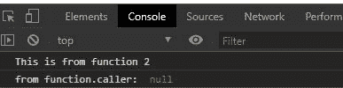
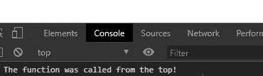

# JavaScript 函数.调用者属性

> 原文:[https://www . geesforgeks . org/JavaScript-function-caller-property/](https://www.geeksforgeeks.org/javascript-function-caller-property/)

JavaScript 函数对象的 **function.caller** 属性返回调用指定函数的函数。如果函数“f”是由 JavaScript 中的顶级代码调用的，它将返回 null。对于像严格函数、异步函数和生成器函数这样的函数，该方法返回 **null。**

**语法:**

```html
function.caller
```

**参数:**此功能不接受任何参数。

**返回值:**对于严格函数、异步函数和生成器函数调用方，该函数返回 null。

为了更好地理解函数方法，下面给出了几个例子。

**例 1:**

## 超文本标记语言

```html
<!DOCTYPE html>
<html lang="en">

<head>
    <meta charset="UTF-8">
    <meta name="viewport" content=
        "width=device-width,
        initial-scale=1.0">
</head>

<body>
    <script>

        // Creating func2
        function func2() {
            console.log("This is from function 2")
        }
        // Creating func1
        function func1() {
            func2();
        }

        // Call Function 1
        func1();

        // null is returned as function
        // is strict, async function and
        // generator function
        console.log("from function.caller: ",
                                func1.caller)
    </script>
</body>

</html>
```

**输出:**



**例 2:**

## 超文本标记语言

```html
<!DOCTYPE html>
<html lang="en">

<head>
    <meta charset="UTF-8">
    <meta name="viewport" content=
            "width=device-width,
            initial-scale=1.0">
</head>

<body>
    <script>
        function myFunc() {
            if (myFunc.caller == null)
                console.log("The function "
                    + "was called from the top!");
            else
                console.log("This function's "
                    + "caller was " + myFunc.caller);
    }
        myFunc()
    </script>
</body>

</html>
```

**输出:**



**支持的浏览器:**

*   谷歌 Chrome 1 及以上版本
*   微软 Edge 12 及以上版本
*   Mozilla Firefox 1 及以上版本
*   Internet Explorer 8 及更高版本
*   Safari 3 及以上版本
*   Opera 9.6 及以上