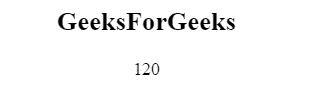
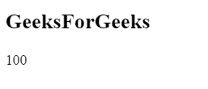
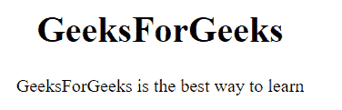
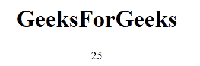

# JavaScript |函数定义

> 原文:[https://www . geesforgeks . org/JavaScript-函数-定义/](https://www.geeksforgeeks.org/javascript-function-definitions/)

**函数**关键字用于定义 JavaScript 函数定义。

**语法:**

*   **功能声明:**

    ```
    function functionName( parameters ) {
        // Statements
    }
    ```

*   **函数表达式:**

    ```
    var variableName = functionName( parameter ) {
        // Statements
    }; 
    ```

*   **函数构造器:**

    ```
    var FunctionName = new Function("parameter", "return parameter");
    var variableName = FunctionName(values); 
    ```

**参数:**包含单参数**功能名称**，为必选项，用于指定功能名称。

**示例:**该示例描述了函数声明。

```
<!DOCTYPE html>
<html>

<head>
    <title>
        Function Declarations
    </title>
</head>

<body style="text-align:center;">

    <h2>GeeksForGeeks</h2>

    <p id="geeks"></p>

    <script>
        var var1 = GFG(40, 3);

        document.getElementById("geeks").innerHTML = var1;

        function GFG(num1, num2) {
            return num1 * num2;
        }
    </script>
</body>

</html>                    
```

**输出:**


**示例 2:** 本示例描述变量中存储的函数表达式。

```
<!DOCTYPE html>
<html>

<head>
    <title>
        Function Expressions
    </title>
</head>

<body>

    <h2>GeeksForGeeks</h2>

    <p id="geeks"></p>

    <script>
        var var1 = function (num1, num2) {
                return num1 * num2
            };

        document.getElementById("geeks").innerHTML
                = var1(20, 30);
    </script>
</body>

</html>                    
```

**输出:**


**例 3:** 本例描述了函数构造器的使用。

```
<!DOCTYPE html>
<html>

<head>
    <title>
        Function Expressions
    </title>
</head>

<body>

    <h2>GeeksForGeeks</h2>

    <p id="geeks"></p>

    <script>
        var GFG = new Function("num1", "num2", "return num1 * num2");

        document.getElementById("geeks").innerHTML = GFG(25, 4);
    </script>
</body>

</html>                    
```

**输出:**


**功能提升:**是将声明移动到当前范围顶部的机制。函数声明被提升到封闭函数的顶部，通过函数提升，我们可以在函数声明之前使用它。使用表达式定义的函数不会被提升。

**示例:**

```
<!DOCTYPE html>
<html>

<head>
    <title>
        Function Hoisting
    </title>
</head>

<body style="text-align:center;">
    <h1>GeeksForGeeks</h1>

    <script>
        GeeksForGeeks(); 
        function GeeksForGeeks() {
            document.write("Welcome to GeeksForGeeks");
        }
    </script>
</body>

</html>                    
```

**输出:**


**自调用函数:**一个自调用函数在你创建时自动运行，自调用函数没有名字。如果表达式后面跟有()，那么函数表达式将自动执行，并且您不能调用函数声明。

**示例:**

```
<!DOCTYPE html>
<html>

<head>
    <title>
        Function Hoisting
    </title>
</head>

<body style="text-align:center;">
    <h1>GeeksForGeeks</h1>

    <p id="geeks"></p>

    <script>
        (function () {
            document.getElementById("geeks").innerHTML
                = "GeeksForGeeks is the best way to learn";
        })();
    </script>
</body>

</html>                    
```

**输出:**


**函数是对象:**可以把函数描述成对象，既有属性又有方法。

*   当把函数定义为对象的属性时，它就被称为对象的方法。
*   当设计一个函数来创建新对象时，它被称为对象构造函数。

**示例:**

```
<!DOCTYPE html>
<html>

<head>
    <title>
        Function Hoisting
    </title>
</head>

<body style="text-align:center;">
    <h1>GeeksForGeeks</h1>

    <p>Number of arguments :</p>

    <p id="geeks"></p>

    <script>
        function GeeksForGeeks(num1, num2) {
            return arguments.length;
        }

        document.getElementById("geeks").innerHTML 
                = GeeksForGeeks(4, 3);
    </script>
</body>

</html>                    
```

**输出:**


**Arrow Functions:** 通过实现 Arrow Functions，编写函数表达式变得更加容易，并且它还允许编写函数表达式的简短语法，并且不需要 function 关键字、return 关键字和花括号。

**示例:**

```
<!DOCTYPE html>
<html>

<head>
    <title>
        Function Hoisting
    </title>
</head>

<body style="text-align:center;">
    <h1>GeeksForGeeks</h1>

     <p id="geeks"></p>

    <script>
        const var1 = (num1, num2) => num1 * num2;

        document.getElementById("geeks").innerHTML
                = var1(5, 5);
    </script>
</body>

</html>                    
```

**输出:**
