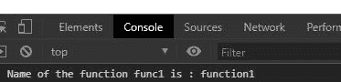
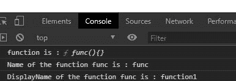

# JavaScript 函数. displayName 属性

> 原文:[https://www . geesforgeks . org/JavaScript-function-display name-property/](https://www.geeksforgeeks.org/javascript-function-displayname-property/)

下面是**函数的基本例子。**

```

<script>
    function func1(){}
    func1.displayName="someName"
    console.log(func1.displayName)
</script>
```

**输出:**

```
someName 
```

JavaScript 中的**函数. displayName** 属性用于设置函数的显示名称。如果使用*显示名称*属性记录名称，而不设置函数的*显示名称*属性，则输出将是未定义的。

**语法:**

```
function.displayName = name
```

**返回值:**不返回任何内容，而是设置函数的显示名称。

**注意:**默认功能显示名称为**未定义**。

为了更好地理解**函数，下面给出了几个例子。**

**例 1:**

## 超文本标记语言

```
<!DOCTYPE html>
<html lang="en">

<head>
    <meta charset="UTF-8">
    <meta name="viewport" content=
        "width=device-width, initial-scale=1.0">
</head>

<body>
    <script>

        // Creating function name func1
        function func1() {

            // Logging to console
            console.log("This is from function 1")
        }

        // Changing the func1 name to function1
        // using the function.displayname
        func1.displayName = "function1"
        console.log("Display name of the function"
                + " func1 is :", func1.displayName)
    </script>
</body>

</html>
```

**输出:**



**例 2:**

## 超文本标记语言

```
<!DOCTYPE html>
<html lang="en">

<head>
    <meta charset="UTF-8">
    <meta name="viewport" content=
        "width=device-width, initial-scale=1.0">
</head>

<body>
    <script>

        // Creating function name func
        function func() { }

        // Changing the func name to function1
        // using the func.displayname
        func.displayName = "function1"
        console.log("function is :", func)

        // Logging name of the function
        // using function.name property
        console.log("Name of the function "
                + "func is :", func.name)
        console.log("DisplayName of the "
                + "function func is :", 
                func.displayName)
    </script>
</body>

</html>
```

**输出:**



**支持的浏览器:**。

*   谷歌 Chrome
*   Mozilla Firefox