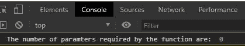
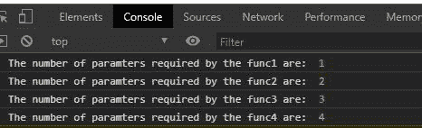

# JavaScript 函数. length 属性

> 原文:[https://www . geesforgeks . org/JavaScript-function-length-property/](https://www.geeksforgeeks.org/javascript-function-length-property/)

**函数. length**JavaScript 中函数对象的属性用于返回函数所需的参数个数。

**语法:**

```
function.length
```

**参数:**该方法不需要参数。

**返回:**返回类型为数字。

为了更好地理解该方法，下面给出了几个例子。

**例 1:**

## 超文本标记语言

```
<!DOCTYPE html>
<html lang="en">
<head>
  <meta charset="UTF-8">
  <meta name="viewport"
        content="width=device-width,
                initial-scale=1.0">
  <title>Document</title>
</head>
<body>
  <script>
    // Creating function name func
    // When no parameters are given
    function func1(){}
    console.log(
"The number of parameters required by "+
     "the function are: ", func1.length)
  </script>
</body>
</html>
```

**输出:**



**例 2:**

当参数数量大于 1 时。

## 超文本标记语言

```
<!DOCTYPE html>
<html lang="en">
<head>
  <meta charset="UTF-8">
  <meta name="viewport"
        content="width=device-width,
                 initial-scale=1.0">
  <title>Document</title>
</head>
<body>
  <script>
    // Creating function name func
    // When one parameters are given
    function func1(a){}
    console.log(
"The number of parameters required by the func1 are: ",
  func1.length)
    // When two parameters are given
    function func2(a, b){}
    console.log(
"The number of parameters required by the func2 are: ",
 func2.length)
    // When three parameters are given
    function func3(a, b, c){}
    console.log(
"The number of parameters required by the func3 are: ",
 func3.length)
    // When four parameters are given
    function func4(a, b, c, d){}
    console.log(
"The number of parameters required by the func4 are: ",
 func4.length)
  </script>
</body>
</html>
```

**输出:**



**例 3:**

当给出参数数组时

## 超文本标记语言

```
<!DOCTYPE html>
<html lang="en">
<head>
  <meta charset="UTF-8">
  <meta name="viewport"
        content="width=device-width,
                 initial-scale=1.0">
  <title>Document</title>
</head>
<body>
  <script>
    // Creating function name func
    // When array of arguments are given
    function func4(...args){}
    console.log(
"The number of parameters required by the func4 are: ",
 func4.length)
  </script>
</body>
</html>
```

**输出:**


支持的浏览器:

*   Chrome 1 及以上
*   边缘 12 及以上
*   Firefox 1 及以上版本
*   Internet Explorer 4 及以上版本
*   歌剧 3 及以上
*   Safari 1 及以上