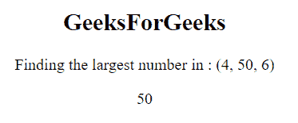
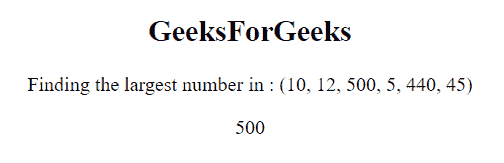
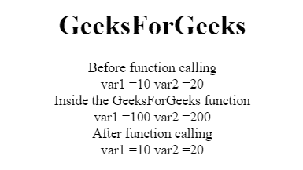
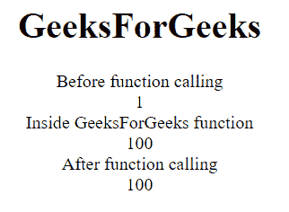

# JavaScript |函数参数

> 原文:[https://www . geesforgeks . org/JavaScript-function-parameters/](https://www.geeksforgeeks.org/javascript-function-parameters/)

函数**参数**是在函数定义中定义的名称，在函数定义中传递给函数的实数值称为参数。

**语法:**

```
function Name(paramet1, paramet2, paramet3,paramet4) {
    // Statements
}
```

**参数规则:**

*   不需要在 JavaScript 函数定义中为参数指定数据类型。
*   它不根据传入的 JavaScript 函数执行类型检查。
*   它不检查收到的参数数量。

**参数:**

*   **名称:**用于指定函数的名称。
*   **参数:**在函数的参数字段中提供。

**示例:**本示例使用 JavaScript 函数参数并查找最大数值。

```
<!DOCTYPE html>
<html>

<head>
    <title>
        Function Parameters and Arguments
    </title>
</head>

<body style="text-align:center;">

    <h2>GeeksForGeeks</h2>

    <p>Finding the largest number : (4, 50, 6)</p>

    <p id="geeks"></p>

    <script>
        function GFG( var1, var2, var3 ) {
            if( var1 > var2 ) {
                if( var1 > var3 ) {
                    return var1;
                }
                else {
                    return var3;
                }
            }
            else {
                if( var2 > var3 ) {
                    return var2;
                }
                else {
                    return var3;
                }
            }
        } 
        document.getElementById("geeks").innerHTML
                = GFG(4, 50, 6);
    </script>
</body>

</html>                    
```

**输出:**


**默认参数:**默认参数用于在没有值或未定义的情况下，用默认值初始化命名参数。

**语法:**

```
function Name(paramet1 = value1, paramet2 = value2 .. .) {
    // statements
}
```

**示例:**本示例使用默认参数并执行数字乘法。

```
<!DOCTYPE html>
<html>

<head>
    <title>
        Function Parameters and Arguments
    </title>
</head>

<body style="text-align:center;">

    <h2>GeeksForGeeks</h2>

    <p>GFG Function multiply : </p>

    <p id="geeks"></p>

    <script>
        function GFG(num1, num2 = 2) {
            return num1 * num2;
        }

        document.getElementById("geeks").innerHTML
                = GFG(4);
    </script>
</body>

</html>                    
```

**输出:**


**参数对象:**参数对象是 JavaScript 函数中的内置对象。在所有非箭头函数中，arguments 对象是一个局部变量。使用函数的参数对象分析函数内部的参数。

**示例:**

```
<!DOCTYPE html>
<html>

<head>
    <title>
        Function Parameters and Arguments
    </title>
</head>

<body style="text-align:center;">

    <h2>GeeksForGeeks</h2>

    <p>
        Finding the largest number in :
        (10, 12, 500, 5, 440, 45) 
    </p>

    <p id="geeks"></p>

    <script>
        function GFG() {
            var i;
            var maxnum = -Infinity;
            for(i = 0; i < arguments.length; i++) {
                if (arguments[i] > maxnum) {
                    maxnum = arguments[i];
                }
            }
            return maxnum;
        } 
        document.getElementById("geeks").innerHTML
                = GFG(10, 12, 500, 5, 440, 45);
    </script>
</body>

</html>                    
```

**输出:**


**参数按值传递:**在函数调用中，参数作为参数调用。传递值将变量值发送给函数。它不发送变量的地址。如果函数改变了参数的值，那么它不会影响原始值。
T3】例:

```
<!DOCTYPE html>
<html>

<head>
    <title>
        Arguments are Passed by Value
    </title>
</head>

<body style="text-align:center;">

    <h1>GeeksForGeeks</h1>

    <p id="geeks"></p>

    <!-- Script to illustrate the use of arguments
        passed by value -->
    <script>

        /* Function definition */
        function GeeksForGeeks(var1, var2) { 
            document.write("Inside the GeeksForGeeks function"); 
            document.write('<br/>');

            var1 = 100; 
            var2 = 200; 

            /* Display the value of variable inside function */
            document.write("var1 =" + var1 +" var2 =" +var2); 
            document.write('<br/>');
        } 

        var1 = 10; 
        var2 = 20;

        /* The value of variable before Function call */
        document.write("Before function calling"); 
        document.write('<br/>');

        document.write("var1 =" + var1 +" var2 =" +var2); 
        document.write('<br/>');

        /* Function call */
        GeeksForGeeks(var1,var2);

        /* The value of variable after Function call */
        document.write("After function calling"); 
        document.write('<br/>');

        document.write("var1 =" + var1 +" var2 =" +var2);
        document.write('<br/>');
    </script>
</body>

</html>                    
```

**输出:**


**通过引用传递的对象:**在通过引用传递的对象中，传递变量的地址而不是值作为调用函数的参数。如果我们改变函数内部变量的值，那么它将影响函数外部变量。

**示例:**

```
<!DOCTYPE html>
<html>

<head>
    <title>
        Arguments are Passed by Value
    </title>
</head>

<body style="text-align:center;">

    <h1>GeeksForGeeks</h1>

    <p id="geeks"></p>

    <script>
        function GeeksForGeeks(varObj) { 
            document.write("Inside GeeksForGeeks function"); 
            document.write('<br/>');
            varObj.a = 100; 
            document.write(varObj.a); 
            document.write('<br/>');
        } 

        // Create object
        varObj = {a:1};

        /* Display value of object before function call */
        document.write("Before function calling"); 
        document.write('<br/>');
        document.write(varObj.a);
        document.write('<br/>');

        /* Function calling */
        GeeksForGeeks(varObj) 

        /* Display value of object after function call */
        document.write("After function calling");
        document.write('<br/>'); 
        document.write(varObj.a);
    </script>
</body>

</html>                    
```

**输出:**
