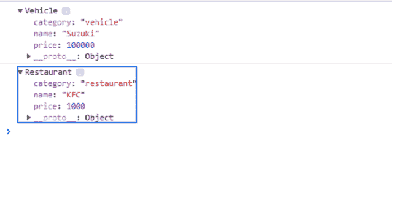

# JavaScript function . prototype . call()方法

> 原文:[https://www . geesforgeks . org/JavaScript-函数-原型-调用-方法/](https://www.geeksforgeeks.org/javascript-function-prototype-call-method/)

**call()** 方法允许分配属于一个对象的函数调用，并为不同的对象调用。它为功能提供了*这个*的新价值。**调用()**方法允许您一次性编写一个方法，并允许它在另一个对象中继承，而无需为新对象重写方法。

**语法:**

```
myFunc.call([thisArg[, arg1, arg2, ...argN]])
```

**参数:**

*   **此参数:**调用 *myFunc* 函数时用作*此*的值。
*   **arg1，arg2，…，argN:** 这些是上述函数的参数。

**注意:**在某些情况下，*该参数*可能不是实际值。如果该方法处于非严格模式，原始值将被转换为对象并为空，*未定义的*将被替换为全局对象。

**返回值:**作为函数调用的结果，它返回指定的*这个*值和参数。

**示例 1:** 以下示例演示了如何使用调用来链接对象的构造函数。

```
<script>
function Product(name,
     price) {
    this.name = name;
    this.price = price;
  }

  function Vehicle(name, 
           price) {
   Product.call(this,
           name, price);
    this.category = 'vehicle';
  }

  function Restaurant(name,
           price) {
   Product.call(this, 
           name, price);
    this.category = 'restaurant';
  }

  const car = new Vehicle('Suzuki',
        100000);
  const restau = new 
        Restaurant('KFC', 1000);

  console.log(car);
  console.log(restaurant);
</script>
```

**输出:**



**示例 2:** 以下示例演示了使用 **call()** 方法调用匿名函数。

```
<script>
const Birds = [
    { species: 'Peagion', name: 'King' },
    { species: 'Crow', name: 'Fail' }
  ];

let i=0;
 while(i<Birds.length){ 
  (function(i) {
    this.print = function() {
     console.log('#' + i + ' ' 
            + this.species
              + ': ' + this.name);
      }
      this.print();
    }).call(Birds[i], i);
    ++i;
  }
</script>
```

**输出:**

```
#0 Peagion: King
#1 Crow: Fail

```

**示例 3:** 以下示例演示了使用**调用**方法来调用函数，并为*“this”*指定上下文。

```
<script>
function greet() {
  const reply = [this.animal, 
    'typically sleep between',
        this.sleepDuration].join(' ');
    console.log(reply);
  }

  const obj = {
    animal: 'Rats', 
    sleepDuration: '2 and 5 hours'
  };

  greet.call(obj);
</script>
```

**输出:**

```
 Rats typically sleep between 2 and 5 hours

```

**示例 4:** 下面的示例演示了使用 **call()** 方法在不指定第一个参数的情况下调用函数。

```
<script>
var str = 'Brad';

function display() {
  console.log('string value is %s ',
     this.str);
}

display.call();
</script>
```

**输出:**

```
 string value is Brad

```

**注意:**在严格模式下，*这个*的值是不定义的。

```
<script>
'use strict';

var str = 'Brad';

function display() {
  console.log('str value is %s ', 
   this.str);
}
display.call();
</script>
```

**输出:**

```
Cannot read property 'str' of undefined

```