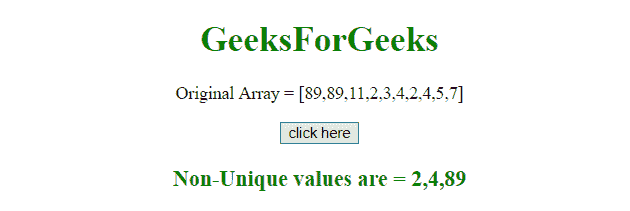
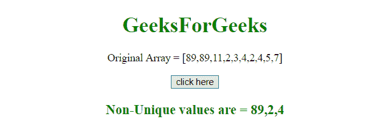

# JavaScript |从数组中获取所有非唯一值

> 原文:[https://www . geesforgeks . org/JavaScript-从数组中获取所有非唯一值/](https://www.geeksforgeeks.org/javascript-get-all-non-unique-values-from-an-array/)

我们有一个 Javascript 数组，我们想找到数组中所有非唯一的元素。要从数组中获取所有非唯一值，这里有几个例子。

**数组切片()方法**
该方法返回新数组对象中的选定元素。
此方法从指定的开始参数开始获取元素，并在排除给定的结束参数时结束。
**语法:**

```
array.slice(start, end)

```

**参数:**

*   **开始:**此参数为可选。它指定从何处开始选择的整数(索引从 0 开始)。负数用于从数组末尾进行选择。如果不使用，它的行为就像“0”。
*   **结束:**此参数为可选。它指定选择结束的整数。如果不使用，将选择从数组开始到结束的所有元素。负数用于从数组末尾进行选择。

**示例-1:** 本示例首先对数组进行排序，如果数组不唯一，则逐个选择。

```
<!DOCTYPE html>
<html>

<head>
    <title>
        JavaScript 
      | Get all non-unique values.
    </title>
</head>

<body style="text-align:center;" id="body">
    <h1 style="color:green;">  
            GeeksForGeeks  
        </h1>
    <p id="GFG_UP" style="font-size: 16px;">

    </p>
    <button onclick="gfg_Run()">
        click here
    </button>
    <p id="GFG_DOWN" style="color:green; 
                            font-size: 20px; 
                            font-weight: bold;">
    </p>
    <script>
        var el_up = document.getElementById("GFG_UP");
        var el_down = document.getElementById("GFG_DOWN");
        var arr = [89, 89, 11, 2, 3, 4, 2, 4, 5, 7];
        var sort_arr = arr.slice().sort();
        var res = [];
        el_up.innerHTML = "Original Array = [" + arr + "]";;

        function gfg_Run() {
            for (var i = 0; i < sort_arr.length - 1; i++) {
                if (sort_arr[i + 1] == sort_arr[i]) {
                    res.push(sort_arr[i]);
                }
            }
            el_down.innerHTML = "Non-Unique values are = " + res;
        }
    </script>
</body>

</html>
```

**输出:**

*   **点击按钮前:**
    
*   **点击按钮后:**
    

**示例-2:** 这个示例制作一个字典，然后存储每个元素的频率。后来如果他们发现频率超过 1，那么元素就会被选中。

```
<!DOCTYPE html>
<html>

<head>
    <title>
        JavaScript
      | Get all non-unique values.
    </title>
</head>

<body style="text-align:center;" id="body">
    <h1 style="color:green;">  
            GeeksForGeeks  
        </h1>
    <p id="GFG_UP" style="font-size: 16px;">

    </p>
    <button onclick="gfg_Run()">
        click here
    </button>
    <p id="GFG_DOWN" style="color:green; 
                            font-size: 20px; 
                            font-weight: bold;">
    </p>
    <script>
        var el_up = document.getElementById("GFG_UP");
        var el_down = document.getElementById("GFG_DOWN");
        var arr = [89, 89, 11, 2, 3, 4, 2, 4, 5, 7];
        el_up.innerHTML = "Original Array = [" + arr + "]";;

        function gfg_Run() {
            var len = arr.length,
                output = [],
                count = {};

            for (var i = 0; i < len; i++) {
                var item = arr[i];
                count[item] = count[item] >= 1 ? count[item] + 1 : 1;
                if (count[item] === 2) {
                    output.push(item);
                }
            }
            el_down.innerHTML = "Non-Unique values are = " + output;
        }
    </script>
</body>

</html>
```

**输出:**

*   **点击按钮前:**
    
*   **点击按钮后:**
    