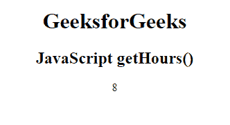
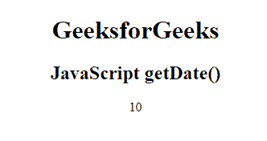
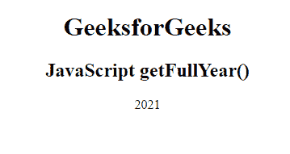
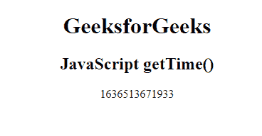
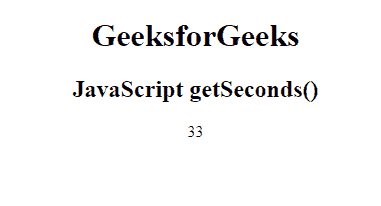

# JavaScript 获取日期方法

> 原文:[https://www.geeksforgeeks.org/javascript-get-date-methods/](https://www.geeksforgeeks.org/javascript-get-date-methods/)

在本文中，我们将了解如何从 Javascript 中的 date 对象获取各种日期方法。在 JavaScript 中有各种检索日期的方法。数据值可以是年、月、日、小时、分钟、秒、毫秒。

下面是用 Javascript 从 date 对象中检索各种日期的 Date 方法列表。

**方法:**

*   [**【getDate()】**](https://www.geeksforgeeks.org/javascript-date-getdate-method/)**:**用来取日为数字(1-31)。
*   [**getFullYear()**](https://www.geeksforgeeks.org/javascript-date-getfullyear-method/)T4:用来取年份。
*   [**getHours()**](https://www.geeksforgeeks.org/javascript-date-gethours-method/) **:用于获取小时(0-23)。**
*   [**get 毫秒()**](https://www.geeksforgeeks.org/javascript-date-getmilliseconds-method/) **:** 用于获取毫秒(0-999)。
*   [**getMinutes()**](https://www.geeksforgeeks.org/javascript-date-getminutes-method/) **:用于获取分钟(0-59)。**
*   [**【getMonth()】**](https://www.geeksforgeeks.org/javascript-date-getmonth-method/)**:用于取月份(0-11)。**
*   [**getSeconds()**](https://www.geeksforgeeks.org/javascript-date-getseconds-method/) **:用于获取秒(0-59)。**
*   [**【getTime()**](https://www.geeksforgeeks.org/javascript-date-gettime-method/)**:**它用来返回 1970 年 1 月 1 日以来的毫秒数。
*   [**【getDay()**](https://www.geeksforgeeks.org/javascript-date-getday-method/)**:**用于取工作日为数字(0-6)。
*   [**date . now()**](https://www.geeksforgeeks.org/javascript-date-now-method/)**:**用于返回自 1970 年 1 月 1 日 00:00:00 UTC 起经过的毫秒数。

我们将实现不同的日期方法，并通过示例了解它们的用法。

**getHours()方法:**JavaScript 中的 getHours()方法用于以数字(0-23)的形式返回日期的小时数。

**示例:**本示例描述了 getHours()方法，用于从 date 对象检索指定日期到本地时间的小时。

## 超文本标记语言

```
<!DOCTYPE html>
<html>

<head>
    <title> JavaScript getHours() Method </title>
</head>

<body style="text-align:center;">
    <h1>GeeksforGeeks</h1>
    <h2>JavaScript getHours()</h2>
    <p id="GFG"></p>

    <!-- Script to use getHours() method -->
    <script>
    var d = new Date();
    document.getElementById("GFG").innerHTML = d.getHours();
    </script>
</body>

</html>
```

**输出:**



getHours()方法

**getDate()方法:**JavaScript 中的 getDate()方法用于以数字(1-31)的形式返回日期的日期。

**示例:**本示例描述了从 Date 对象中检索当月当前日期的 getDate()方法。

## 超文本标记语言

```
<!DOCTYPE html>
<html>

<head>
    <title>JavaScript getDate() Method</title>
</head>

<body style="text-align:center;">
    <h1>GeeksforGeeks</h1>
    <h2>JavaScript getDate()</h2>
    <p id="GFG"></p>

    <!-- Script to use getDate() method -->
    <script>
    var d = new Date();
    document.getElementById("GFG").innerHTML = d.getDate();
    </script>
</body>

</html>
```

**输出:**



getDate()方法

**getMonth()方法:**JavaScript 中的 getMonth()方法用于将日期的月份作为数字(0-11)返回。

**示例:**本示例描述了从日期对象中检索月份的 getMonth()方法。

## 超文本标记语言

```
<!DOCTYPE html>
<html>

<head>
    <title>JavaScript getMonth() Method</title>
</head>

<body style="text-align:center;">
    <h1>GeeksforGeeks</h1>
    <h2>JavaScript getMonth()</h2>
    <p id="GFG"></p>

    <!-- Script to use getMonth() method -->
    <script>
    var d = new Date();
    document.getElementById("GFG").innerHTML = d.getMonth()+1;
    </script>
</body>

</html>
```

在 Javascript 中，月号从 0 开始，表示第一个月 ie。，一月&以表示最后一个月 ie 的月号 11 结束。，十二月。所以，我们需要加 1 得到当前月份。

**输出:**


getMonth()方法

**getFullYear()方法:**JavaScript 中的 getFullYear()方法用于根据当地时间返回指定日期的年份(4 位数)。

**示例:**本示例描述了从日期对象中检索年份的 getFullYear()方法。

## 超文本标记语言

```
<!DOCTYPE html>
<html>

<head>
    <title>JavaScript getFullYear() Method</title>
</head>

<body style="text-align:center;">
    <h1>GeeksforGeeks</h1>
    <h2>JavaScript getFullYear()</h2>
    <p id="GFG"></p>

    <!-- Script to use getFullYear() method -->
    <script>
    var d = new Date();
    document.getElementById("GFG").innerHTML = d.getFullYear();
    </script>
</body>

</html>
```

**输出:**



getFullYear()方法

**getTime()方法:**JavaScript 中的 getTime()方法用于返回毫秒数(0–999)。

**示例:**本示例描述了从日期对象中检索毫秒数的 getTime()方法。

## 超文本标记语言

```
<!DOCTYPE html>
<html>

<head>
    <title>JavaScript getTime() Method</title>
</head>

<body style="text-align:center;">
    <h1>GeeksforGeeks</h1>
    <h2>JavaScript getTime()</h2>
    <p id="GFG"></p>

    <!-- Script to use getTime() method -->
    <script>
    var d = new Date();
    document.getElementById("GFG").innerHTML = d.getTime();
    </script>
</body>

</html>
```

**输出:**



getTime()方法

**getSeconds()方法:**JavaScript 中的 getSeconds()方法返回日期对象的秒数(0-59)。

**示例:**本示例描述了从日期对象中检索秒的 getSeconds()方法。

## 超文本标记语言

```
<!DOCTYPE html>
<html>

<head>
    <title>JavaScript getSeconds() Method</title>
</head>

<body style="text-align:center;">
    <h1>GeeksforGeeks</h1>
    <h2>JavaScript getSeconds()</h2>
    <p id="GFG"></p>

    <!-- Script to use getSeconds() method -->
    <script>
    var d = new Date();
    document.getElementById("GFG").innerHTML = d.getSeconds();
    </script>
</body>

</html>
```

**输出:**



getSeconds()方法

**支持的浏览器:**

*   谷歌 Chrome 1.0
*   Firefox 1.0
*   微软边缘 12.0
*   Internet Explorer 4.0
*   Opera 3.0
*   Safari 1.0