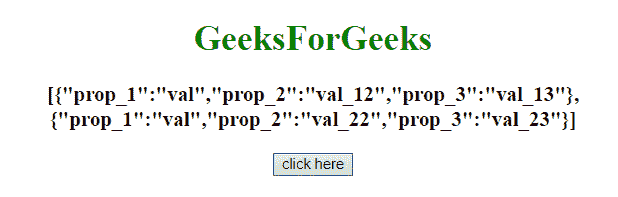
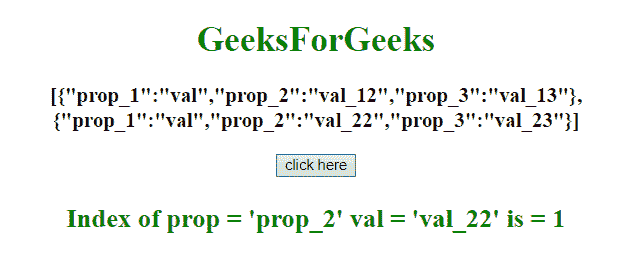

# JavaScript |通过对象的属性获取对象的索引。

> 原文:[https://www . geesforgeks . org/JavaScript-按属性获取对象索引/](https://www.geeksforgeeks.org/javascript-get-the-index-of-an-object-by-its-property/)

任务是使用 javascript 从给定属性名和属性值的对象数组中获取对象的索引。我们将讨论一些技巧。
首先要知道的几个方法。

*   **[JavaScript Array map() Method](https://www.geeksforgeeks.org/javascript-array-map-method/):**
    This method creates a new array with the return value of calling a function for every array element.
    This method calls the provided function once for each element in an array, with maintaining the order.

    **语法:**

    ```
    array.map(function(currentValue, index, arr), thisValue)

    ```

    **参数:**

    *   **函数(currentValue，index，arr):** 此参数是必需的。它为数组中的每个元素指定要运行的函数。
        *   **当前值:**此参数为必填项。它指定当前元素的值。
        *   **索引:**此参数为可选。它指定当前元素的数组索引。
        *   **arr:** 此参数可选。它指定当前元素所属的数组对象。
    *   **该值:**该参数可选。它指定要传递给函数的值，用作它的“this”值。
        如果该参数为空，将传递值“未定义”。

    **示例 1:** 本示例在数组中搜索属性名称及其值，如果得到，则返回对象的索引，否则返回-1。

    ```
    <!DOCTYPE HTML>
    <html>

    <head>
        <title>
            JavaScript | Get index of object by its property.
        </title>
    </head>

    <body style="text-align:center;" id="body">
        <h1 style="color:green;">  
                GeeksForGeeks  
            </h1>
        <p id="GFG_UP" style="font-size: 19px; 
                  font-weight: bold;">
        </p>
        <button onClick="GFG_Fun()">
            click here
        </button>
        <p id="GFG_DOWN" style="color: green;
                  font-size: 24px;
                  font-weight: bold;">
        </p>
        <script>
            var up = document.getElementById('GFG_UP');
            var arrayObj = [{
                prop_1: 'val',
                prop_2: 'val_12',
                prop_3: 'val_13'
            }, {
                prop_1: 'val',
                prop_2: 'val_22',
                prop_3: 'val_23'
            }];
            var down = document.getElementById('GFG_DOWN');
            up.innerHTML = JSON.stringify(arrayObj);

            function fun_2(array, attr, value) {
                for (var i = 0; i < array.length; i += 1) {
                    if (array[i][attr] === value) {
                        return i;
                    }
                }
                return -1;
            }

            function GFG_Fun() {
                var prop = 'prop_2';
                var val = 'val_22';

                down.innerHTML = "Index of prop = '" +
                    prop + "' val = '" + val +
                    "' is = " + fun_2(arrayObj, prop, val);
            }
        </script>
    </body>

    </html>
    ```

    **输出:**

    *   **点击按钮前:**
        
    *   **点击按钮后:**
        

    **示例 2:** 本示例使用 **JavaScript Array map()方法**获取给定属性的对象的索引。

    ```
    <!DOCTYPE HTML>
    <html>

    <head>
        <title>
            JavaScript 
          | Get index of object by its property.
        </title>
    </head>

    <body style="text-align:center;" 
          id="body">
        <h1 style="color:green;">  
                GeeksForGeeks  
            </h1>
        <p id="GFG_UP" 
           style="font-size: 19px;
                  font-weight: bold;">
        </p>
        <button onClick="GFG_Fun()">
            click here
        </button>
        <p id="GFG_DOWN" 
           style="color: green;
                  font-size: 24px; 
                  font-weight: bold;">
        </p>
        <script>
            var up = document.getElementById('GFG_UP');
            var arrayObj = [{
                prop_1: 'val',
                prop_2: 'val_12',
                prop_3: 'val_13'
            }, {
                prop_1: 'val',
                prop_2: 'val_22',
                prop_3: 'val_23'
            }];
            var down = document.getElementById('GFG_DOWN');
            up.innerHTML = JSON.stringify(arrayObj);

            function GFG_Fun() {
                var prop = 'prop_2';
                var val = 'val_22';
                down.innerHTML = "Index of prop = 
                '" + prop + "' val = '" + val + 
                "' is = " + arrayObj.map(function(e) {
                    return e.prop_2;
                }).indexOf(val);
            }
        </script>
    </body>

    </html>
    ```

    **输出:**

    *   **点击按钮前:**
        
    *   **点击按钮后:**
        