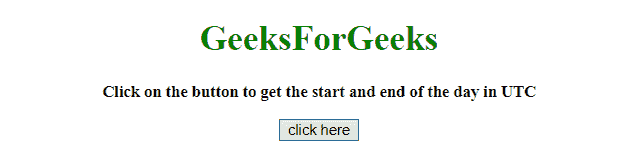
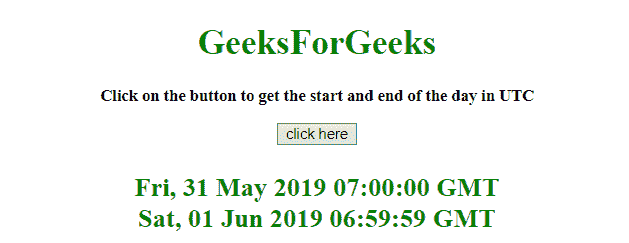

# JavaScript |以 UTC

获取一天的开始和结束时间

> 原文:[https://www . geesforgeks . org/JavaScript-获取 utc 中的开始和结束时间/](https://www.geeksforgeeks.org/javascript-get-the-start-and-end-of-the-day-in-utc/)

给定一个日期，任务是使用 javascript 确定一天的开始和结束。我们将讨论一些技巧。
首先要知道的几个方法。

*   **[JavaScript setHours() Method](https://www.geeksforgeeks.org/javascript-date-sethours-function/):**
    This method sets the hour of a date object.
    This method can be used to set the minutes, seconds and milliseconds.
    **Syntax:**

    ```
    Date.setHours(hour, min, sec, millisec)

    ```

    **参数:**

    *   **小时:**此参数为必填项。它指定表示小时的整数。接受的值为 0-23，但也允许其他值。

    *   -1 表示前一天的最后一个小时，24 表示第二天的第一个小时。
*   **分钟:**此参数为可选。它指定表示分钟的整数。接受的值为 0-59，但也允许其他值。
    *   60 表示下一小时的第一分钟，-1 表示前一小时的最后一分钟。
*   **秒:**此参数可选。它指定表示秒的整数。接受的值为 0-59，但也允许其他值。
    *   60 表示下一分钟的第一秒，而-1 表示前一分钟的最后一秒。
*   **毫秒:**此参数为可选。它指定表示毫秒的整数。接受的值为 0-999，但也允许其他值。
    *   -1 表示前一秒的最后一毫秒，1000 表示下一秒的第一毫秒。

**返回值:**
返回一个数字，代表日期对象到 1970 年 1 月 1 日午夜之间的毫秒数。

*   **[JavaScript toUTCString() Method](https://www.geeksforgeeks.org/javascript-date-toutcstring-function/):**
    This method converts a Date object to a string, depending on universal time.
    **Syntax:**

    ```
    Date.toUTCString()

    ```

    **返回值:**
    返回一个字符串，以字符串形式表示 UTC 日期和时间。

    **示例 1:** 本示例使用 **setHours()方法**获取一天中的第一毫秒和最后一毫秒，并使用**stoutchstring()方法**将其转换为 UTC 格式。

    ```
    <!DOCTYPE HTML>
    <html>

    <head>
        <title>
            JavaScript 
          | Get start and end of day in UTC.
        </title>
        <script src=
    "https://ajax.googleapis.com/ajax/libs/jquery/3.4.0/jquery.min.js">
        </script>
    </head>

    <body style="text-align:center;" 
          id="body">
        <h1 style="color:green;">  
                GeeksForGeeks  
            </h1>
        <p id="GFG_UP"
           style="font-size: 15px; 
                  font-weight: bold;">
        </p>
        <button onclick="GFG_Fun(); ">
            click here
        </button>
        <p id="GFG_DOWN"
           style="color: green;
                  font-size: 24px;
                  font-weight: bold;">
        </p>
        <script>
            var up = document.getElementById('GFG_UP');
            up.innerHTML =
              'Click on the button to get the'+
              ' start and end of the day in UTC';

            var down = document.getElementById('GFG_DOWN');
            var startOfDay = new Date();
            startOfDay.setHours(0, 0, 0, 0);
            var endofDay = new Date();
            endofDay.setHours(23, 59, 59, 999);

            function GFG_Fun() {
                down.innerHTML = startOfDay.toUTCString() + 
                  '<br>' + endofDay.toUTCString();
            }
        </script>
    </body>

    </html>
    ```

    **输出:**

    *   **点击按钮前:**
        
    *   **点击按钮后:**
        

    **示例 2:** 本示例获取一天中的第一毫秒和最后一毫秒，但方法与之前不同，使用 **setHours()方法**并使用**stoutchstring()方法**将其转换为 UTC 格式。

    ```
    <!DOCTYPE HTML>
    <html>

    <head>
        <title>
            JavaScript 
          | Get start and end of day in UTC.
        </title>
        <script src=
    "https://ajax.googleapis.com/ajax/libs/jquery/3.4.0/jquery.min.js">
        </script>
    </head>

    <body style="text-align:center;" 
          id="body">
        <h1 style="color:green;">  
                GeeksForGeeks  
            </h1>
        <p id="GFG_UP"
           style="font-size: 15px; 
                  font-weight: bold;">
        </p>
        <button onclick="GFG_Fun(); ">
            click here
        </button>
        <p id="GFG_DOWN" 
           style="color: green; 
                  font-size: 24px; 
                  font-weight: bold;">
        </p>
        <script>
            var up = document.getElementById('GFG_UP');
            up.innerHTML = 
              'Click on the button to get the start '+
              'and end of the day in UTC';

            var down = document.getElementById('GFG_DOWN');
            var startOfDay = new Date();
            startOfDay.setHours(0, 0, 0, 0);
            var endofDay = new Date();
            endofDay.setHours(24, 0, 0, -1);

            function GFG_Fun() {
                down.innerHTML = startOfDay.toUTCString() +
                  '<br>' + endofDay.toUTCString();
            }
        </script>
    </body>

    </html>
    ```

    **输出:**

    *   **点击按钮前:**
        
    *   **点击按钮后:**
        