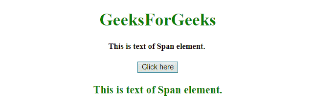

# JavaScript |获取跨度元素的文本

> 原文:[https://www . geesforgeks . org/JavaScript-get-the-text-of-span-element/](https://www.geeksforgeeks.org/javascript-get-the-text-of-a-span-element/)

给定一个 HTML 文档，任务是获取一个元素的文本。有两种方法可用于获取跨度元素，下面将对此进行讨论:

*   **HTML DOM textContent Property:** This property set/return the text content of the defined node, and all its descendants. By setting the textContent property, the child nodes are removed and are replaced by a single Text node having the specified string.

    **语法:**

    *   **返回节点的文本内容。**

    ```
    node.textContent

    ```

*   **设置节点的文本内容。**

    ```
    node.textContent = text

    ```

**属性值:**包含单值**文本**，指定指定节点的文本内容。

**返回值:**返回一个字符串，代表节点及其所有后代的文本。如果元素是文档、文档类型或符号，则返回 null。

*   **HTML DOM innerText Property:** This property set/return the text content of defined node, and all its descendants. By setting the innerText property, any child nodes are removed and are replaced by a single Text node having the specified string.

    **语法:**

    *   **返回节点的文本内容。**

        ```
        node.innerText

        ```

    *   **设置节点的文本内容。**

        ```
        node.innerText = text

        ```

    **属性值:**包含单值**文本**，指定指定节点的文本内容。

    **返回值:**返回一个字符串，表示节点及其所有后代的“渲染”文本内容。

    **示例 1:** 本示例使用**文本内容属性**获取内容。

    ```
    <!DOCTYPE HTML> 
    <html> 
        <head> 
            <title> 
                JavaScript | Get the text of a span element
            </title>
        </head> 

        <body style = "text-align:center;" id = "body"> 

            <h1 style = "color:green;" > 
                GeeksForGeeks 
            </h1> 

            <span id="GFG_Span" style = "font-size: 15px; font-weight: bold;"> 
                This is text of Span element. 
            </span>

            <br><br>

            <button onclick = "gfg_Run()"> 
                Click here
            </button>

            <p id = "GFG_DOWN" style = 
                "color:green; font-size: 20px; font-weight: bold;">
            </p>

            <script>
                var span = document.getElementById("GFG_Span");
                var el_down = document.getElementById("GFG_DOWN");

                function gfg_Run() {
                    el_down.innerHTML = span.textContent;
                }         
            </script> 
        </body> 
    </html>                    
    ```

    **输出:**

    *   **点击按钮前:**
        
    *   **点击按钮后:**
        

    **示例 2:** 本示例通过使用**内部文本属性**获取内容。

    ```
    <!DOCTYPE HTML> 
    <html> 
        <head> 
            <title> 
                JavaScript | Get the text of a span element
            </title>
        </head> 

        <body style = "text-align:center;" id = "body"> 

            <h1 style = "color:green;" > 
                GeeksForGeeks 
            </h1> 

            <span id="GFG_Span" style = "font-size: 15px; font-weight: bold;"> 
                This is text of Span element. 
            </span>

            <br><br>

            <button onclick = "gfg_Run()"> 
                Click here
            </button>

            <p id = "GFG_DOWN" style = 
                "color:green; font-size: 20px; font-weight: bold;">
            </p>

            <script>
                var span = document.getElementById("GFG_Span");
                var el_down = document.getElementById("GFG_DOWN");

                function gfg_Run() {
                    el_down.innerHTML = span.innerText;
                }         
            </script> 
        </body> 
    </html>                    
    ```

    **输出:**

    *   **点击按钮前:**
        
    *   **点击按钮后:**
        