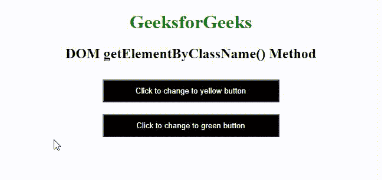
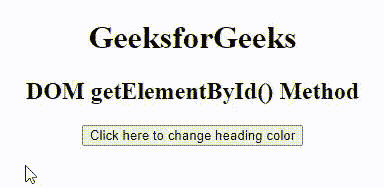

# JavaScript getelement sbyclasname()与 getElementById()方法

> 哎哎哎:# t0]https://www . geeksforgeeks . org/JavaScript-getelementsbyclasname-vs-getelementbyid-method/

在本文中，我们将学习 Javascript 中用于操作 HTML 元素的 get Element 方法。我们还将通过示例了解它们的实现。

[**JavaScript getElementsByClassName()**](https://www.geeksforgeeks.org/html-dom-getelementsbyclassname-method/)**方法:**这个方法返回一个包含所有具有指定类名的对象，作为一个 HTML Collection 对象的集合，代表一个节点的集合。可以使用从零开始的索引来访问返回的元素。

**语法:**

```html
document.getElementsByClassName("class_name");
```

**参数:**想要获取的元素的类名。

**返回值:**该函数返回 HTML 集合对象。

**示例 1:** 这个示例描述了 getElementsByClassName()方法来查找所有包含相同类名的 HTML 元素。

## 超文本标记语言

```html
<!DOCTYPE html>
<html>

<head>
    <style>
    h1 {
        color: green;
    }

    body {
        text-align: center;
    }

    button {
        background-color: black;
        color: white;
        width: 300px;
        padding: 10px;
        margin: 10px;
        cursor: pointer;
    }
    </style>
</head>

<body>
    <h1>GeeksforGeeks</h1>
    <h2>DOM getElementByClassName() Method</h2>
    <div>
        <button onclick="yellow()"
                class="black yellow">
            Click to change to yellow button
        </button>
        <br>
        <button onclick="green()"
                class="green">
            Click to change to green button
        </button>
        <br>
    </div>
    <script>
    function yellow() {
        document.getElementsByClassName('yellow')[0].style.backgroundColor =
        'yellow';
    }

    function green() {
        var elements = document.getElementsByClassName('green');
        for(var i = 0; i < elements.length; i++) {
            elements[i].style.backgroundColor = 'green';
        }
    }
    </script>
</body>

</html>
```

**输出:**



getelemontbyclassname_)方法

[**JavaScript getElementById()方法**](https://www.geeksforgeeks.org/php-domdocument-getelementbyid-function/) **:** 该方法返回具有指定值的 Id 属性的元素。这是最常用的操纵或获取文档元素信息的方法。

**语法:**

```html
document.getElementById("id_name");
```

**参数:**该函数接受单个参数，即元素 ID，用于保存元素的 ID。

**返回值:**这个函数返回元素的 ID 属性的值。

**示例 2:** 本示例描述了 getElementById()方法，通过应用样式属性来指定元素行为正在改变的 Id 值。

## 超文本标记语言

```html
<!DOCTYPE html>
<html>

<head>
    <script>

    // Function to change the
    // color of element
    function color() {
        var demo = document.getElementById("heading");
        demo.style.color = "green";
    }
    </script>
</head>

<body style="text-align:center">
    <h1 id="heading">GeeksforGeeks</h1>
    <h2>DOM getElementById() Method</h2>

      <!-- Click on the button to change color -->
    <input type="button"
           onclick="color()"
           value="Click here to change heading color" />
</body>

</html>
```

**输出:**从输出中，我们可以注意到这个方法通过点击按钮来修改指定 id 值的 HTML 元素。



getElementById()方法

**getElementsByClassName()Vs getElementById()方法的区别:**

<figure class="table">

**1。**

| 

#### S 号

 | 

#### **getElementById()凯伊姆**

 | 

#### **get element sbyclasse name()凯伊姆**

 |
| --- | --- | --- |
| 此方法返回一个元素对象，该对象指定 id 属性与指定字符串 ie 匹配的元素。，它返回一个其 id 与特定查询匹配的 DOM 元素。 | 这个方法返回一个包含所有给定类名 ie 的所有子元素的类似数组的对象。，它将返回一个 html collection–一个类似数组的结构，包含与查询匹配的 DOM 元素，需要遍历数组中的每个元素来应用样式。 |
| **2。** | 它接受 *id* 作为参数值来定位该特定元素。 | 它将作为字符串的名称作为表示要匹配的类名的参数值。在多个类名的情况下，可以用空格分隔。 |
| **3。** | 如果在文档中没有找到匹配的元素，则返回空值。 | 它返回一个活动的 HTMLCollection，如果在文档中没有找到匹配的元素，可能的长度为 0。 |

</figure>