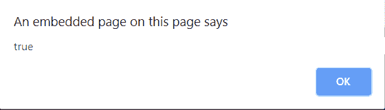
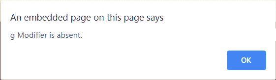

# JavaScript |全局属性

> 原文:[https://www.geeksforgeeks.org/javascript-global-property/](https://www.geeksforgeeks.org/javascript-global-property/)

JavaScript 中的**全局属性**用于指定是否设置了**【g】***修改器*。如果设置了**“g”**修改器，则该属性返回 true，否则返回 false。
**语法:**

```
RegexObj.global
```

**返回值:**如果设置了 g 修饰符，则返回真，否则返回假。
**示例 1:** 本示例检查正则表达式是否包含 g 修饰符。

## 超文本标记语言

```
<!DOCTYPE html>
<html>
    <head>
        <title>global Property</title>
    </head>
    <body style="text-align:center">
        <h1 style="color:green">GeeksforGeeks</h1>
        <h2>global Property</h2>
    <button onclick="geek()">Click it!</button>

    <script>
    function geek() {
        var regex = new RegExp('foo', 'g');
        alert(regex.global);
    }
    </script>
    </body>
</html>
```

**输出:**
**点击按钮前:**


**点击按钮后:**



**示例 2:** 本示例检查正则表达式是否包含 g Modifier。

## 超文本标记语言

```
<!DOCTYPE html>
<html>

<head>
    <title>
      global Property
  </title>
</head>

<body style="text-align:center">
    <h1 style="color:green">
      GeeksforGeeks
  </h1>
    <h2>
     global Property
  </h2>
    <button onclick="geek()">
      Click it!
  </button>

    <script>
        function geek() {
            var regex = /[a-d]/;
            var str =
                "GeeksforGeeks\n"+
                "is the computer\n"+
                "science portal for geeks.";

            if (regex.global) {
                alert("g Modifier is present");
            } else {
                alert("g Modifier is absent.");
            }
        }
    </script>
</body>

</html>
```

**输出:**
**点击按钮前:**


**点击按钮后:**



**支持的浏览器:**JavaScript 全局属性支持的浏览器如下:

*   谷歌 Chrome
*   苹果 Safari
*   Mozilla Firefox
*   歌剧
*   微软公司出品的 web 浏览器