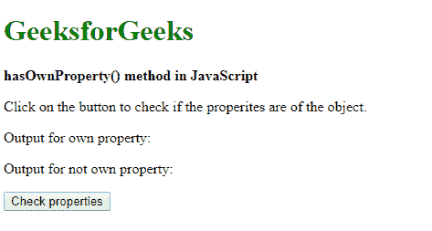
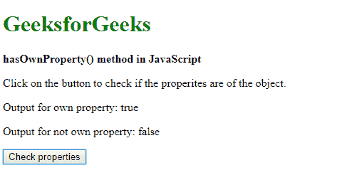

# JavaScript | hasOwnProperty()方法

> 原文:[https://www . geesforgeks . org/JavaScript-hasown property-method/](https://www.geeksforgeeks.org/javascript-hasownproperty-method/)

JavaScript 中的 **hasOwnProperty()** 方法用于检查对象是否有指定的属性作为自己的属性。这对于检查对象是否继承了属性而不是自己的属性很有用。
**语法:**

```
object.hasOwnProperty( prop )
```

**参数:**该方法接受单参数**道具**，该道具以字符串或待测属性符号的形式保存名称。
**返回值:**返回一个布尔值，表示对象是否有给定的属性作为自己的属性。
**示例 1:** 本示例检查对象的属性。

## 超文本标记语言

```
<!DOCTYPE html>
<html>

<head>
    <title>
        JavaScript | hasOwnProperty() Method
    </title>
</head>

<body>
    <h1 style="color: green">
        GeeksforGeeks
    </h1>

    <b>
        hasOwnProperty() method in JavaScript
    </b>

<p>
        Click on the button to check if the
        properties are of the object.
    </p>

<p>Output for own property:
        <span class="outputProperty"></span>
    </p>

<p>Output for not own property:
        <span class="outputNonProperty"></span>
    </p>

    <button onclick="checkProperty()">
        Check properties
    </button>

    <script type="text/javascript">

        function checkProperty() {
            let exampleObj = {};
            exampleObj.height = 100;
            exampleObj.width = 100;

            // Checking for existing property
            result1 = exampleObj.hasOwnProperty("height");

            // Checking for non-existing property
            result2 = exampleObj.hasOwnProperty("breadth");

            document.querySelector(".outputProperty").textContent
                        = result1;

            document.querySelector(".outputNonProperty").textContent
                        = result2;
        }
    </script>
</body>

</html>
```

**输出:**

*   **点击按钮前:**



*   **点击按钮后:**



**示例 2:** 本示例检查一个类的对象的属性。

## 超文本标记语言

```
<!DOCTYPE html>
<html>

<head>
    <title>
        JavaScript hasOwnProperty() method
    </title>
</head>

<body>
    <h1 style="color: green">
        GeeksforGeeks
    </h1>

    <b>
        hasOwnProperty() method in JavaScript
    </b>

<p>
        Click on the button to check if the
        properties are of the object.
    </p>

<p>Output for own property:
        <span class="outputProperty"></span>
    </p>

<p>Output for not own property:
        <span class="outputNonProperty"></span>
    </p>

    <button onclick="checkProperty()">
        Check properties
    </button>

    <script type="text/javascript">

        function checkProperty() {

            function Car(a, b) {
                this.model = a;
                this.name = b;
            }

            let car1 = new Car("Mazda", "Laputa");

            // Checking for existing property
            result1 = car1.hasOwnProperty("model");

            // Checking for non-existing property
            result2 = car1.hasOwnProperty("wheels");

            document.querySelector(".outputProperty").textContent
                        = result1;

            document.querySelector(".outputNonProperty").textContent
                        = result2;
        }
    </script>
</body>

</html>
```

**输出:**

*   **点击按钮前:**


*   **点击按钮后:**


**支持的浏览器:**JavaScript hasown property()方法支持的浏览器如下:

*   谷歌 Chrome 1 及以上版本
*   Firefox 1 及以上版本
*   Internet Explorer 5.5 及以上版本
*   边缘 12 及以上
*   Safari 3 及以上版本
*   歌剧 5 及以上