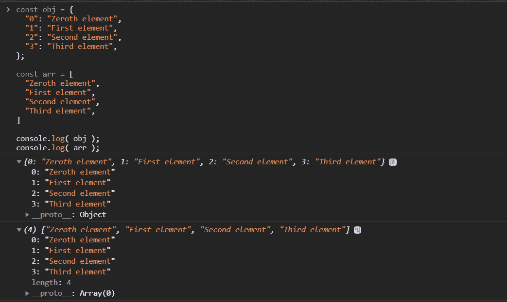

# JavaScript 助手方法

> 原文:[https://www.geeksforgeeks.org/javascript-helper-methods/](https://www.geeksforgeeks.org/javascript-helper-methods/)

JavaScript 中的数组通常被认为是“列表对象”。简单来说，我们可以说数组是包含一些值的对象。但是数组在 JavaScript 中是一个特殊的对象。数组可以存储异构数据结构。它可以存储任何类型的数据值，如对象和数组。

## java 描述语言

```
const arr = [
  1,                        // Number type
  "Praveen kumar",          // String type
  {                         // Object type
    firstname: "Christopher",
    lastname: 'Nolan'
  },
  [9.1, 9.2, 8.7, 5]        // Array type
];

console.log( arr );
```

在 JavaScript 中，数组是一个对象。如果一个数组是一个对象，那么为什么我们不用一个对象来代替一个数组呢”。经过大量的研究，我们发现我们可以用一个对象来代替一个数组。但也有一些警告。



在上面的程序中，对象和数组都以完全相同的方式存储数据。但是有一些不同。

第一个是包含名为 ***长度的属性的数组。*** 它告诉我们一个数组中元素的个数。这不是唯一的区别。当你打开一个数组和一个对象的 ***__proto__*** 属性时，主要区别就出来了。数组附带了一些很棒的助手方法，我们将在本文中讨论。让我们讨论一些重要的方法。

**1。every()方法:**此方法用于检查数组的所有元素是否都通过了由通过的高阶函数实现的测试。编译器在幕后做的是，它遍历*员工*数组，检查所有*员工*，不管他是不是*开发人员*。像这种情况，应该返回 *false* 。

**输入:**

```
 predicate function
```

**输出:**

```
Boolean value
```

## java 描述语言

```
const employees = [
  { name: "Sam",      age: 25, role: "Developer" },
  { name: "John",     age: 32, role: "Manager"   },
  { name: "Ronaldo",  age: 29, role: "Architect" },
  { name: "Perker",   age: 25, role: "Developer" },
  { name: "Sophia",   age: 38, role: "Director"  },
  { name: "kristine", age: 21, role: "Developer" },
];

function isDeveloper(employee) {
  return employee.role === "Developer";
}
console.log(employees.every(isDeveloper));
```

**输出:**

```
false
```

**2。fill()方法:**此方法用静态值填充数组。它覆盖从第一个元素(第 0 个索引)到最后一个元素(array.length-1 索引)的所有数组值。

**输入:**

```
value 
```

**输出:**

```
Modified array
```

## java 描述语言

```
const employees = [
    { name: "Sam",      age: 25, role: "Developer" },
    { name: "John",     age: 32, role: "Manager"   },
    { name: "Ronaldo",  age: 29, role: "Architect" },
    { name: "Perker",   age: 25, role: "Developer" },
    { name: "Sophia",   age: 38, role: "Director"  },
    { name: "kristine", age: 21, role: "Developer" },
];

const newEmployees = employees.fill(
    { name: "Sam", age: 25, role: "Developer" });
console.log(employees);

console.log(newEmployees === employees);    // true
```

**输出:**

```
[
 { name: 'Sam', age: 25, role: 'Developer' },
 { name: 'Sam', age: 25, role: 'Developer' },
 { name: 'Sam', age: 25, role: 'Developer' },
 { name: 'Sam', age: 25, role: 'Developer' },
 { name: 'Sam', age: 25, role: 'Developer' },
 { name: 'Sam', age: 25, role: 'Developer' }
]

true
```

**3。filter()方法:**这个方法用传递给它的函数过滤通过测试的数组。它返回一个新数组。

**输入:**

```
Predicate function
```

**输出**:

```
New Array with filtered elements
```

## java 描述语言

```
const employees = [
    { name: "Sam",      age: 25, role: "Developer" },
    { name: "John",     age: 32, role: "Manager"   },
    { name: "Ronaldo",  age: 29, role: "Architect" },
    { name: "Perker",   age: 25, role: "Developer" },
    { name: "Sophia",   age: 38, role: "Director"  },
    { name: "kristine", age: 21, role: "Developer" },
];

function filterDevEmp(employee) {
  return employee.role === "Developer";
}
const filteredDevEmployees = employees.filter(filterDevEmp);
console.log(filteredDevEmployees);
```

**输出:**

```
[
 { name: 'Sam', age: 25, role: 'Developer' },
 { name: 'Perker', age: 25, role: 'Developer' },
 { name: 'kristine', age: 21, role: 'Developer' }
]
```

**4。find()方法:**这个方法返回第一个用提供的函数通过测试的元素。

**输入:**

```
Predicate function 
```

**输出:**

```
Element that passes the test else undefined
```

## java 描述语言

```
const employees = [
    { name: "Sam",      age: 25, role: "Developer" },
    { name: "John",     age: 32, role: "Manager"   },
    { name: "Ronaldo",  age: 29, role: "Architect" },
    { name: "Perker",   age: 25, role: "Developer" },
    { name: "Sophia",   age: 38, role: "Director"  },
    { name: "kristine", age: 21, role: "Developer" },
];

function searchFirstDevEmployee(employee) {
  return employee.role === "Developer";
}

const firstEmployeeDeveloper =
    employees.find(searchFirstDevEmployee);

console.log(firstEmployeeDeveloper);   
```

**输出:**

```
 { name: 'Sam', age: 25, role: 'Developer' }
```

**5。findIndex()方法:**该方法返回第一个通过测试的元素 ***索引*** 所提供的函数。它可以用在原语的情况下，也可以用在对象的情况下。

**输入:**

```
Predicate function
```

**输出:**

```
element index that passes the test else -1
```

## java 描述语言

```
const employees = [
    { name: "Sam",      age: 25, role: "Developer" },
    { name: "John",     age: 32, role: "Manager"   },
    { name: "Ronaldo",  age: 29, role: "Architect" },
    { name: "Perker",   age: 25, role: "Developer" },
    { name: "Sophia",   age: 38, role: "Director"  },
    { name: "kristine", age: 21, role: "Developer" },
];

function searchFirstArchitectEmployeeIndex(employee) {
  return employee.role === "Architect";
}

const firstEmpArchitectIndex =
  employees.findIndex(searchFirstArchitectEmployeeIndex);

console.log(firstEmpArchitectIndex);   
```

**输出:**

```
2
```

**6。flat()方法:**此方法用于将数组展平或递归连接数组与子数组元素。

**输入:**

```
 depth(default value is 1)
```

**输出:**

```
New array
```

## java 描述语言

```
const arr1 = [1, [2, 3, 4], 5];
const flattened1 = arr1.flat();
console.log(flattened1); // [ 1, 2, 3, 4, 5 ]

const arr2 = [1, 2, [3, 4, [5, 6]]];

const flattened2 = arr2.flat();
console.log(flattened2); // [1, 2, 3, 4, [5, 6]]
```

**输出:**

```
[1, 2, 3, 4, 5]
[1, 2, 3, 4, [5, 6]]
```

**7。forEach()方法:**这是最常用的方法之一。它用于为数组中的每个元素调用或执行一次提供/传递的函数。*修改原阵。*

**输入:**

```
function
```

**输出:**

```
undefined
```

## java 描述语言

```
const employees = [
    { name: "Sam",      age: 25, role: "Developer" },
    { name: "John",     age: 32, role: "Manager"   },
    { name: "Ronaldo",  age: 29, role: "Architect" },
    { name: "Perker",   age: 25, role: "Developer" },
    { name: "Sophia",   age: 38, role: "Director"  },
    { name: "kristine", age: 21, role: "Developer" },
];

function increaseAgeByOne(employee) {
  employee.age += 1;
}
employees.forEach(increaseAgeByOne);
console.log(employees);
```

**输出:**

```
[
 { name: 'Sam', age: 26, role: 'Developer' },
 { name: 'John', age: 33, role: 'Manager' },
 { name: 'Ronaldo', age: 30, role: 'Architect' },
 { name: 'Perker', age: 26, role: 'Developer' },
 { name: 'Sophia', age: 39, role: 'Director' },
 { name: 'kristine', age: 22, role: 'Developer' }
]
```

**8。includes()方法:**此方法用于测试数组中是否存在元素。它检查原语中的值，并在对象的情况下检查引用。

**输入:**

```
value
```

**输出:**

```
Boolean value weather array includes value or not
```

## java 描述语言

```
const numbers = [1, 6, 8, 11, 5, 9, 4];
console.log( numbers.includes(6) ); 
console.log( numbers.includes(3) );
```

**输出:**

```
true
false
```

**如果是物体**

## java 描述语言

```
const arch = { name: "Ronaldo", age: 29, role: "Architect" };

const employees = [
  { name: "Sam", age: 25, role: "Developer" },
  { name: "John", age: 32, role: "Manager" },
  arch,
  { name: "Perker", age: 25, role: "Developer" },
  { name: "Sophia", age: 38, role: "Director" },
  { name: "kristine", age: 21, role: "Developer" },
];

console.log(employees.includes(arch));
```

**输出:**

```
true
```

**9。indexOf()方法:**该方法返回通过所提供函数测试的第一个元素索引。它接受一个值作为输入。应该用在原语的情况下。与对象的情况一样，它将检查其引用。Check 区分大小写。

**输入:**

```
value
```

**输出:**

```
element index that passes the test else -1
```

## java 描述语言

```
const names = ["Sam", "John", "Ronaldo",
    "Perker", "Sophia", "kristine"];
names.indexOf("John");   
names.indexOf("john");
```