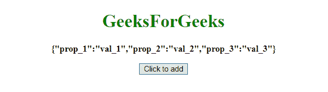
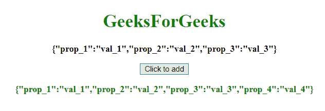

# JavaScript |如何给 JSON 对象添加元素？

> 原文:[https://www . geesforgeks . org/JavaScript-如何向 json 对象添加元素/](https://www.geeksforgeeks.org/javascript-how-to-add-an-element-to-a-json-object/)

为了将**键/值**对添加到 **JSON 对象**中，我们要么使用**点符号**要么使用**方括号符号**。这两种方法都被广泛接受。

**示例 1:** 本示例使用**点符号**将**{“prop _ 4”:“val _ 4”}**添加到 GFG_p 对象中。

```
<!DOCTYPE html>
<html>

<head>
    <title>
        JavaScript |
      Add a key/value pair to JSON object
    </title>
</head>

<body style="text-align:center;">

    <h1 style="color:green;">  
            GeeksForGeeks  
        </h1>

    <p id="GFG_up"
       style=" font-weight: bold">
    </p>

    <button onclick="Geeks()">
        Click to add
    </button>

    <p id="GFG_down" 
       style="color:green;
              font-weight: bold" ;>
    </p>

    <script>
        var GFG_p = {
            prop_1: "val_1",
            prop_2: "val_2",
            prop_3: "val_3"
        };
        var p_up = 
            document.getElementById("GFG_up");
        var p_down = 
            document.getElementById("GFG_down");
        p_up.innerHTML = 
          JSON.stringify(GFG_p);

        function Geeks() {
            GFG_p.prop_4 = "val_4";
            p_down.innerHTML = JSON.stringify(GFG_p);
        }
    </script>
</body>

</html>
```

**输出:**

*   **点击按钮前:**
    
*   **点击按钮后:**
    

**示例 2:** 本示例通过使用**方括号符号**将**{“prop _ 4”:“val _ 4”}**添加到 GFG_p 对象中。

```
<!DOCTYPE html>
<html>

<head>
    <title>
        JavaScript 
      | Add a key/value pair to JSON object
    </title>
</head>

<body style="text-align:center;">

    <h1 style="color:green;">  
            GeeksForGeeks  
        </h1>

    <p id="GFG_up"
       style=" font-weight: bold">
    </p>

    <button onclick="Geeks()">
        Click to add
    </button>

    <p id="GFG_down" 
       style="color:green; 
              font-weight: bold" ;>
    </p>

    <script>
        var GFG_p = {
            prop_1: "val_1",
            prop_2: "val_2",
            prop_3: "val_3"
        };
        var p_up = 
            document.getElementById("GFG_up");
        var p_down = 
            document.getElementById("GFG_down");
        p_up.innerHTML = 
          JSON.stringify(GFG_p);

        function Geeks() {
            GFG_p["prop_4"] = "val_4";
            p_down.innerHTML = JSON.stringify(GFG_p);
        }
    </script>
</body>

</html>
```

**输出:**

*   **点击按钮前:**
    
*   **点击按钮后:**
    