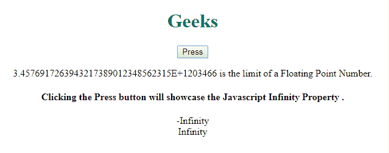

# JavaScript 无限属性

> 原文:[https://www.geeksforgeeks.org/javascript-infinity-property/](https://www.geeksforgeeks.org/javascript-infinity-property/)

以下是**无限属性**的示例。

*   **例:**

    ```
    <script>
        function test() {
            document.write(
            -3.645464512375121213E+1203466 +
            "<br>"
            + 3.4548643575312453512345E+1203466);
        }
        test();
    </script>
    ```

*   **输出:**

    ```
    -Infinity
    Infinity
    ```

**无穷大属性**用于显示超过浮点数上限时的**无穷大**和超过浮点数下限时的**-无穷大**。这里，无穷大表示正无穷大，-无穷大表示负无穷大。

**语法:**

```
floating point no.
```

**返回值:**返回无穷大表示正无穷大，-无穷大表示负无穷大。

以上属性的更多示例代码如下:
**程序 1:**

```
<!DOCTYPE html>
<html>
<head>
    <style>
        h1 {
            color: green;
        }
    </style>
</head>

<body>
    <center>
        <h1>
          Geeks
      </h1>
        <button onclick="test()">
          Press
      </button>
        <p>
          3.4576917263943217389012348562315E+1203466 is
          the limit of a Floating Point Number.</p>

        <h4>
          Clicking the Press button will 
          showcase the Javascript Infinity Property.
      </h4>

        <p id="gfg"></p>

        <script>
            function test() {
                document.getElementById(
                  "gfg").innerHTML =
                  -3.4576917263943217389012348562315E+1203466 +
                  "<br>"
                  + 3.4576917263943217389012348562315E+1203466;
            }
        </script>
    </center>
</body>

</html>
```

**输出:**


**支持的浏览器:**

*   谷歌 Chrome*   火狐浏览器*   微软公司出品的 web 浏览器*   旅行队*   歌剧