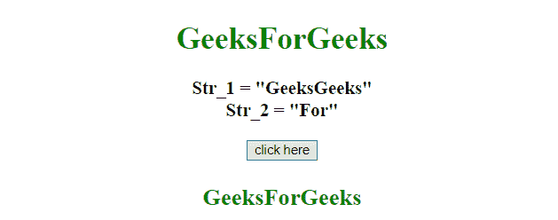

# JavaScript |在另一个字符串的 X 位置插入一个字符串

> 原文:[https://www . geesforgeks . org/JavaScript-在另一个字符串的 x 位置插入一个字符串/](https://www.geeksforgeeks.org/javascript-insert-a-string-at-position-x-of-another-string/)

给定 2 个字符串，任务是使用 javascript 将一个字符串插入另一个字符串的指定位置，我们将讨论一些技巧。
首先要知道的几个方法。

*   **[JavaScript String slice() method](https://www.geeksforgeeks.org/javascript-string-slice/):**
    This method gets parts of a string and returns the extracted parts in a new string.
    Start and end parameters are used to specify the part of the string to extract.
    First character starts from position 0, the second has position 1, and so on.
    **Syntax:**

    ```html
    string.slice(start, end)

    ```

    **参数:**

    *   **开始:**此参数为必填项。它指定开始提取的位置。第一个字符从位置 0 开始。
    *   **结束:**此参数为可选。它指定停止提取的位置(不包括它)。如果不使用，slice()将选择从开始位置到结束位置的所有字符。

    **返回值:**
    返回一个字符串，代表字符串的提取部分。

*   **[JavaScript Array join()方法](https://www.geeksforgeeks.org/javascript-array-join-method/) :**
    该方法将数组的元素添加到一个字符串中，并返回该字符串。
    元素将由一个传递的分隔符分隔。默认分隔符是逗号(，)。
    **语法:**

```html
array.join(separator)

```

**参数:**

*   **分隔符:**此参数为可选。它指定要使用的分隔符。如果不使用，元素用逗号分隔

**返回值:**
返回一个字符串，表示数组值，用定义的分隔符隔开。

*   **[JavaScript String substr() Method](https://www.geeksforgeeks.org/javascript-string-substr/):**
    This method gets parts of a string, starting at the character at the defined position, and returns the specified number of characters.
    **Syntax:**

    ```html
    string.substr(start, length)

    ```

    **参数:**

    *   **开始:**此参数为必填项。它指定开始提取的位置。第一个字符位于索引 0 处。
        如果 start 为正数，并且大于或等于字符串的长度，则此方法返回一个空字符串。
        如果 start 为负，则该方法从末尾将其作为索引。
        如果 start 为负或大于字符串长度，start 将被用作 0。
    *   **长度:**此参数可选。它指定要提取的字符数。如果不使用，它将提取整个字符串。

    **返回值:**
    它返回一个新的字符串，包含文本的提取部分。如果长度为 0 或负数，则返回空字符串。

    **示例 1:** 本示例使用**切片()和 join()方法**将一个字符串插入到另一个字符串中。

    ```html
    <!DOCTYPE HTML>
    <html>

    <head>
        <title>
            JavaScript 
          | Insert string at position X of another string.
        </title>
    </head>

    <body style="text-align:center;"
          id="body">
        <h1 style="color:green;">  
                GeeksForGeeks  
            </h1>
        <p id="GFG_UP" 
           style="font-size: 19px;
                  font-weight: bold;">
        </p>
        <button onclick="GFG_Fun(); ">
            click here
        </button>
        <p id="GFG_DOWN" 
           style="color: green; 
                  font-size: 24px; 
                  font-weight: bold;">
        </p>
        <script>
            var up = document.getElementById('GFG_UP');
            var down = document.getElementById('GFG_DOWN');
            var a = 'GeeksGeeks';
            var b = 'For';
            var pos = 5;
            up.innerHTML = 'Str_1 = "' + a + 
              '"<br>Str_2 = "' + b + '"';

            function GFG_Fun() {
                down.innerHTML = 
                  [a.slice(0, pos), b, a.slice(pos)].join('')
            }
        </script>
    </body>

    </html>
    ```

    **输出:**

    *   **点击按钮前:**
        
    *   **点击按钮后:**
        

    **示例 2:** 本示例使用 **substr()方法**将一个字符串插入到另一个字符串中。

    ```html
    <!DOCTYPE HTML>
    <html>

    <head>
        <title>
            JavaScript 
          | Insert string at position X of another string.
        </title>
    </head>

    <body style="text-align:center;" 
          id="body">
        <h1 style="color:green;">  
                GeeksForGeeks  
            </h1>
        <p id="GFG_UP"
           style="font-size: 19px;
                  font-weight: bold;">
        </p>
        <button onclick="GFG_Fun(); ">
            click here
        </button>
        <p id="GFG_DOWN" 
           style="color: green;
                  font-size: 24px;
                  font-weight: bold;">
        </p>
        <script>
            var up = document.getElementById('GFG_UP');
            var down = document.getElementById('GFG_DOWN');
            var a = 'GeeksGeeks';
            var b = 'For';
            var pos = 5;
            up.innerHTML = 'Str_1 = "' + a 
            + '"<br>Str_2 = "' + b + '"';

            function GFG_Fun() {
                down.innerHTML = 
                  a.substr(0, pos) + b + a.substr(pos);
            }
        </script>
    </body>

    </html>
    ```

    **输出:**

    *   **点击按钮前:**
        
    *   **点击按钮后:**
        