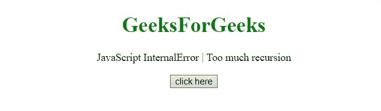

# JavaScript 内部错误|递归太多

> 原文:[https://www . geesforgeks . org/JavaScript-internal error-太多-递归/](https://www.geeksforgeeks.org/javascript-internalerror-too-much-recursion/)

当有许多函数调用时，或者即使一个函数缺少一个基本用例，也会出现异常**太多递归**或**超过最大调用堆栈大小。**

**消息:**

```
Error: Out of stack space (Edge)
InternalError: too much recursion (Firefox)
RangeError: Maximum call stack size exceeded (Chrome)

```

**错误类型:**

```
InternalError
```

递归函数是重复调用自身的函数。当满足条件时，函数停止调用自己。这被称为基本情况。如果条件不满足，那么函数会继续调用自己，并出现错误。

**示例 1:** 这个示例工作完美，没有错误。因为，停止条件是 x > = 5。

## 超文本标记语言

```
<!DOCTYPE HTML>
<html>

<body style="text-align:center;">
    <h1 style="color:green;">
        GeeksForGeeks
    </h1>
    <p>
        JavaScript InternalError 
        | Too much recursion
    </p>

    <button onclick="Geeks();">
        click here
    </button>

    <p id="GFG"></p>

    <script>
        var elDown = document.getElementById("GFG");

        function recursion(x) {

            // Base case
            if (x >= 5)
                return;
            recursion(x + 1); // the recursive call
        }
        function Geeks() {
            try {
                recursion(0);
                elDown.innerHTML = "Too much "
                    + "recursion error not occurred";
            } catch (e) {
                elDown.innerHTML = "Too much "
                    + "recursion error occurred";
            }
        } 
    </script>
</body>

</html>
```

**输出:**


**例 2:** 在本例中，停止条件为 x>= 10000000000000。这是一个很大的值，因此出现了错误。

## 超文本标记语言

```
<!DOCTYPE HTML>
<html>

<body style="text-align:center;">
    <h1 style="color:green;">
        GeeksForGeeks
    </h1>

    <p>
        JavaScript InternalError | Too much recursion
    </p>

    <button onclick="Geeks();">
        click here
    </button>

    <p id="GFG_DOWN"></p>

    <script>
        var elDown = document.getElementById("GFG_DOWN");
        function recursion(x) {

            // Base case
            if (x >= 1000000000000)
                return;
            recursion(x + 1); // the recursive call
        }
        function Geeks() {
            try {
                recursion(0);
                elDown.innerHTML = "Too much recursion"
                        + " error not occurred";
            } catch (e) {
                elDown.innerHTML = "Too much recursion"
                        + " error occurred";
            }
        } 
    </script>
</body>

</html>
```

**输出:**
