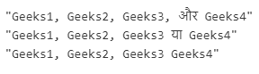

# JavaScript | Intl。ListFormat.prototype.format()方法

> 原文:[https://www . geesforgeks . org/JavaScript-intl-list format-prototype-format-method/](https://www.geeksforgeeks.org/javascript-intl-listformat-prototype-format-method/)

**国际号码。listformat . prototype . format()**方法是 JavaScript 中的一个内置方法，它返回一个带有列表的特定语言表示的字符串。
**语法:**

```
listFormat.format([list]);
```

**参数:**该方法接受上述单个参数，描述如下:

*   **列表:**此参数保存一个可迭代的对象，如数组。

**返回值:**这个方法返回一个语言特定的格式化字符串，代表列表的元素。
下面的例子说明了国际号码。JavaScript 中的 ListFormat.prototype.format()方法:
**示例 1:**

## java 描述语言

```
<script>
const gfg = ['Geeks1', 'Geeks2', 'Geeks3', 'Geeks4'];

const result1 = new Intl.ListFormat('en',
    { style: 'long', type: 'conjunction' });
console.log(result1.format(gfg));

const result2 = new Intl.ListFormat('db',
    { style: 'short', type: 'disjunction' });
console.log(result2.format(gfg));

const result3 = new Intl.ListFormat('en',
    { style: 'narrow', type: 'unit' });
console.log(result3.format(gfg));
</script>
```

**输出:**

```
"Geeks1, Geeks2, Geeks3, and Geeks4"
"Geeks1, Geeks2, Geeks3, or Geeks4"
"Geeks1 Geeks2 Geeks3 Geeks4"
```

**例 2:**

## java 描述语言

```
<script>
const gfg = ['Geeks1', 'Geeks2', 'Geeks3', 'Geeks4'];

const result1 = new Intl.ListFormat('hi',
    { style: 'long', type: 'conjunction' });
console.log(result1.format(gfg));

const result2 = new Intl.ListFormat('hi',
    { style: 'short', type: 'disjunction' });
console.log(result2.format(gfg));

const result3 = new Intl.ListFormat('hi',
    { style: 'narrow', type: 'unit' });
console.log(result3.format(gfg));
</script>
```

**输出:**



**支持的浏览器:**Intl 支持的浏览器。ListFormat.prototype.format()方法如下:

*   谷歌 Chrome 72 及以上
*   边缘 79 及以上
*   Firefox 78 及以上版本
*   歌剧 60 及以上
*   Safari 14.1 及以上版本