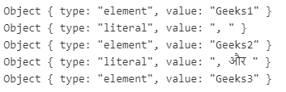

# JavaScript | Intl。listform . prototype . formattoparts()方法

> 原文:[https://www . geesforgeks . org/JavaScript-intl-list format-prototype-formattoparts-method/](https://www.geeksforgeeks.org/javascript-intl-listformat-prototype-formattoparts-method/)

**国际号码。listformat . prototype . formattoparts()**方法是 JavaScript 中的一个内置方法，它返回一个表示不同组件的对象数组，这些组件可用于以区域感知的方式格式化值列表。
**语法:**

```
Intl.ListFormat.prototype.formatToParts(list)
```

**参数:**该方法接受上述单个参数，描述如下:

*   **列表:**该参数保存一个要根据区域设置格式化的值数组。

**返回值:**该方法返回一个包含列表中格式化部分的组件数组。
下面的例子说明了国际号码。JavaScript 中的 listformat . prototype . formattoprts()方法:
**示例 1:**

## java 描述语言

```
<script>
const gfg = ['Geeks1', 'Geeks2', 'Geeks3'];
const result = new Intl.ListFormat('en-GB',
    { style: 'long', type: 'conjunction' });

let val = result.formatToParts(gfg);

console.log(val[0]);
console.log(val[1]);
console.log(val[2]);
console.log(val[3]);
console.log(val[4]);
</script>
```

**输出:**

```
Object { type: "element", value: "Geeks1" }
Object { type: "literal", value: ", " }
Object { type: "element", value: "Geeks2" }
Object { type: "literal", value: " and " }
Object { type: "element", value: "Geeks3" }
```

**例 2:**

## java 描述语言

```
<script>
const gfg = ['Geeks1', 'Geeks2', 'Geeks3'];
const result = new Intl.ListFormat('hi',
    { style: 'long', type: 'conjunction' });

let val = result.formatToParts(gfg);

console.log(val[0]);
console.log(val[1]);
console.log(val[2]);
console.log(val[3]);
console.log(val[4]);
</script>
```

**输出:**



**支持的浏览器:**Intl 支持的浏览器。方法如下:

*   谷歌 Chrome 72 及以上
*   边缘 79 及以上
*   Firefox 78 及以上版本
*   歌剧 60 及以上
*   Safari 14.1 及以上