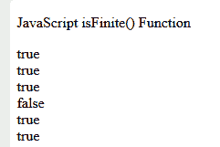

# JavaScript is inite()函数

> 原文:[https://www.geeksforgeeks.org/javascript-isfinite-function/](https://www.geeksforgeeks.org/javascript-isfinite-function/)

JavaScript **是 inite()** 函数，用来检查一个数字是否是有限的合法数字。对于除+infinity、-infinity 或 NaN 之外的所有值，它都返回 true。

**语法:**

```
isFinite(value)
```

**参数:**该方法采用如上所述的单个参数，讨论如下:

*   **值:**这是在 isFinite()函数中传递的必需值。

**返回值:**返回布尔值，即如果值为+无穷大、-无穷大或 NaN，则返回 false，否则返回 true。

## java 描述语言

```
<!DOCTYPE html>
<html>

<body>

<p>JavaScript isFinite() Function</p>

    <script>
        document.write(isFinite(12) + "<br>");
        document.write(isFinite(0) + "<br>");
        document.write(isFinite(12.3) + "<br>");
        document.write(isFinite("Geeks") + "<br>");
        document.write(isFinite("456") + "<br>");
        document.write(isFinite(-46) + "<br>");
    </script>
</body>

</html>
```

**输出:**



**支持的浏览器:**

*   Chrome 1 及以上
*   Firefox 1 及以上版本
*   边缘 12 及以上
*   歌剧 3 及以上
*   Safari 1 及以上