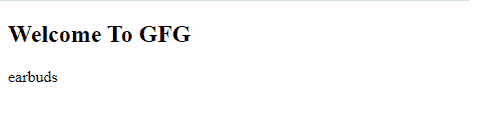
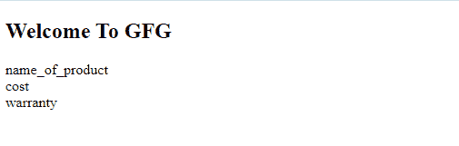
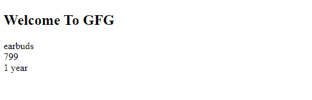

# JavaScript JSON 对象

> 原文:[https://www.geeksforgeeks.org/javascript-json-objects/](https://www.geeksforgeeks.org/javascript-json-objects/)

**JSON 对象:** JavaScript 对象符号(JSON)是一种基于文本的、人类可读的交换格式，用于在基于 web 浏览器的代码中表示简单的数据结构和对象。
JavaScript 对象只能存在于 JavaScript 语言中，所以当你处理需要各种语言访问的数据时，最好参考 JSON。

**声明对象的规则:**

*   对象总是在花括号{ }中定义。
*   对象以键对的形式写入。
*   键必须是字符串，它们的值必须是有效的 JSON 数据类型。
    JSON 数据类型可以是数字、字符串、对象、布尔值、数组或空值。
*   键和值用冒号(“:”分隔。
*   每个键或值对由逗号分隔。

```html
myOrder = {};
```

**示例:**

```html
myOrder = {
    "name of product" : "earbuds", 
    "cost" : "799", 
    "warranty" : "1 year"
};
```

**访问对象值:**

1.  可以通过使用点(")来访问对象值)符号。
2.  我们也可以通过使用方括号([])符号来访问对象。

**示例 1:** 在下面的程序中，我们使用“”访问对象符号。

## 超文本标记语言

```html
<!DOCTYPE html>
<html>

<body>
    <h2>Welcome To GFG</h2>
    <p id="objectaccessing"></p>

    <script>
        var myOrder, i;

        // Object is created with name myOrder
        myOrder = {
            "name_of_the_product": "earbuds", 
            "cost": "799",
            "warranty": "1 year "
        };

        // Accessing for particular detail
        // from object myOrder
        i = myOrder.name_of_the_product;

        // It prints the detail of name
        // of the product
        document.getElementById(
            "objectaccessing").innerHTML = i;
    </script>
</body>

</html>
```

**输出:**

**例 2:**

## 超文本标记语言

```html
<!DOCTYPE html>
<html>

<body>
    <h2>Welcome To GFG</h2>
    <p id="Accessingobj"></p>

    <script>
        var myOrder, i;
        myOrder = {
            "name_of_product": "earbuds", 
            "cost": "799",
            "warranty": "1 year"
        };

        // Accessing object using [] notation
        i = myOrder["name_of_product"];

        document.getElementById(
            "Accessingobj").innerHTML = i;
    </script>
</body>

</html>
```

**输出:**


**JSON 中对象的嵌套:**对象可以嵌套在具有唯一访问路径的其他对象中。在同一文档中，嵌套的对象中可能出现相同的字段名。访问名称必须唯一。简而言之，嵌套对象将在其他对象中定义或分配。

**示例:**

```html

myOrder = {
    "name of product" : "earbuds", 
    "cost" : "799", 
    "warranty" : { 
        "warranty1" : "6 months", 
        "warranty2 : "12 months"
    }
};

```

在上面的例子中，我们已经在对象中声明了另一个对象。

**注意:**我们甚至可以使用点(“.”)来访问嵌套对象)符号。

**示例:**

```html
 i = myOrder.warranty.warranty2;
```

或者

```html
 i = myOrder.warranty[warranty2];
```

**修改对象的值:**要修改值，我们有两种方法。

1.  对象的值可以通过使用点(")来修改。)符号。
2.  对象的值可以通过使用方括号(“[ ]”)来修改。

第一个例子:

```html
myOrder.warranty.warranty2 = "3 months";

```

第二个示例:

```html
i = myOrder.warranty[warranty2] = "3 months";

```

**删除对象属性:**我们可以使用“删除”关键字删除 JSON 对象属性。

**示例:**

```html
delete myOrder.warranty.warranty2;

```

**循环对象:**循环可以通过两种方式完成–

1.  对象的循环可以通过使用 in-loop 的属性来完成。
2.  为了循环一个对象，我们甚至可以在 for-in 循环属性中使用方括号(“[]”)。

**例 1:**

## 超文本标记语言

```html
<!DOCTYPE html>
<html>

<body>
    <h2>Welcome To GFG</h2>
    <p id="AccessingObj"></p>

    <script>
        var myOrder, a;
        myOrder = {
            "name of product": "earbuds",
            "cost": "799", "warranty": "1 year"
        };

        for (a in myOrder) {

            // Accessing loop object 
            // using dot notation
            document.getElementById(
                "AccessingObj").innerHTML
                += a + "<br>";
        }
    </script>
</body>

</html>
```

**输出:**


```html
myObj = {
    "name of product" : "earbuds", 
    "cost" : "799", 
    "warranty" : "1 year"
};
for (a in myOrder) {
    document.getElementById(
        "Accessingobj").innerHTML = a;
}

```

在上面的例子中，我们试图只显示对象。

**示例 2:** 在下面的示例中，我们使用方括号[]符号访问循环对象。

## 超文本标记语言

```html
<!DOCTYPE html>
<html>

<body>
    <h2>Welcome To GFG</h2>
    <p id="Accessingobj"></p>

    <script>
        var myOrder, a;
        myOrder = {
            "name_of_product": "earbuds", 
            "cost": "799",
            "warranty": "1 year"
        };

        for (a in myOrder) {

            // Accesing object in looping
            // using bracket notation
            document.getElementById(
                "Accessingobj").innerHTML
                += myOrder[a] + "<br>";

        }    
    </script>
</body>

</html>
```

**输出:**


```html
myObj = {
    "name of product" : "earbuds", 
    "cost" : "799", 
    "warranty" : "1 year"
}; 

for (a in myOrder) {
    document.getElementById("Accessingobj")
        .innerHTML = myOrder[a];
}

```