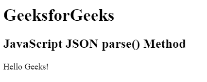
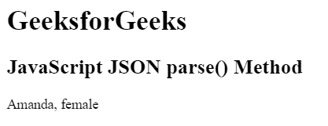

# JavaScript JSON 解析()方法

> 原文:[https://www.geeksforgeeks.org/javascript-json-parse-method/](https://www.geeksforgeeks.org/javascript-json-parse-method/)

下面是 **JSON parse()** 方法的例子。

*   **例:**

    ```
    <script>
            var obj = JSON.parse('{"var1":"Geeks", 
                                   "var2":"forGeeks!"}');

            document.write(obj.var1 + "" + obj.var2);
    </script>                    
    ```

*   **输出:**

    ```
    GeeksforGeeks!
    ```

JavaScript 中的 **JSON.parse()方法**用于解析以 JSON 格式编写的 JSON 字符串，并返回一个 JavaScript 对象。

**语法:**

```
JSON.parse( string, function )
```

**参数:**该方法接受两个参数，如上所述，如下所述:

*   **字符串:**必输参数，包含 JSON 格式编写的字符串。
*   **功能:**可选参数，用于转换结果。为每个项目调用的函数。

上述方法的更多示例代码如下:

**示例 1:** 这个示例解析一个字符串并返回 JavaScript 对象。

```
<!DOCTYPE html>
<html>

<head>
    <title>
        JavaScript JSON parse() Method
    </title>
</head>

<body>

    <h1>GeeksforGeeks</h1>

    <h2>
        JavaScript JSON parse() Method
    </h2>

    <p id="GFG"></p>

    <!-- Script to parse a string and return
        JavaScript object -->
    <script>
        var obj = JSON.parse('{"var1":"Hello", 
                               "var2":"Geeks!"}');

        document.getElementById("GFG").innerHTML
                = obj.var1 + " " + obj.var2;
    </script>
</body>

</html>                    
```

**输出:**


**示例 2:** 本示例使用 reviver 函数解析字符串并返回 JavaScript 对象。

```
<!DOCTYPE html>
<html>

<head>
    <title>
        JavaScript JSON parse() Method
    </title>
</head>

<body>

    <h1>GeeksforGeeks</h1>

    <h2>
        JavaScript JSON parse() Method
    </h2>

    <p id="GFG"></p>

    <!-- Script to parse a string and return
        JavaScript object -->
    <script>
        var text = '{ "var1":"Amanda", "gender":"male"}';

        var obj = JSON.parse(text, function (key, value) {
            if (value == "male") {
                return ("female");
            } else {
                return value;
            }
        });
        document.getElementById("GFG").innerHTML
                = obj.var1 + ", " + obj.gender; 
    </script>
</body>

</html>                    
```

**输出:**


**支持的浏览器:**

*   Chrome 4.0
*   Firefox 3.5
*   Opera 11.0
*   Internet Explorer 8.0
*   Safari 4.0