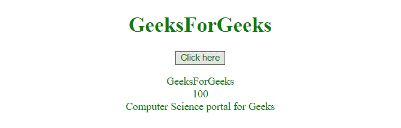

# JavaScript |从 URL 知道 GET 参数的值

> 原文:[https://www . geesforgeks . org/JavaScript-know-value-of-get-parameters-from-URL/](https://www.geeksforgeeks.org/javascript-know-the-value-of-get-parameters-from-url/)

为了知道参数，那些是通过**“GET”**方法传递的，就像有时候我们传递 Email-id、Password 等细节一样。为此，我们使用以下代码片段。

**示例-1:** 本示例从 URL 中获取**“a”**参数的值。

```
<!DOCTYPE html>
<html>

<head>
    <title>
        JavaScript |
      Know the value from GET parameters
    </title>
</head>

<body style="text-align:center;">

    <h1 style="color:green;">  
            GeeksForGeeks  
        </h1>

    <button onclick="myGeeks()">
        Click here
    </button>

    <p id="GFG_down"
       style="color:green;">
    </p>

    <script>
        function myGeeks() {
            var GFG_url_string = 
"https://ide.geeksforgeeks.org/login.php?a=GeeksForGeeks&b=100&c=Computer Science portal for Geeks";

            var GFG_url = new URL(GFG_url_string);
            var c = GFG_url.searchParams.get("a");
            var p_down = document.getElementById("GFG_down");
            p_down.innerHTML = c;
        }
    </script>
</body>

</html>
```

**输出:**

*   **点击按钮前:**
    
*   **点击按钮后:**
    

**示例:**本示例从 URL 获取所有参数的值。

```
<!DOCTYPE html>
<html>

<head>
    <title>
        JavaScript 
      | Know the value from GET parameters
    </title>
</head>

<body style="text-align:center;">

    <h1 style="color:green;">  
            GeeksForGeeks  
        </h1>

    <button onclick="myGeeks()">
        Click here
    </button>

    <p id="GFG_down"
       style="color:green;">
    </p>

    <script>
        function myGeeks() {
            var GFG_url_string = 
"https://ide.geeksforgeeks.org/login.php?a=GeeksForGeeks&b=100&c=Computer Science portal for Geeks";
            var GFG_url = new URL(GFG_url_string);
            var a = GFG_url.searchParams.get("a");
            var b = GFG_url.searchParams.get("b");
            var c = GFG_url.searchParams.get("c");
            var p_down = document.getElementById("GFG_down");
            p_down.innerHTML = a + "<br>" + b + "<br>" + c;
        }
    </script>
</body>

</html>
```

**输出:**

*   **点击按钮前:**
    
*   **点击按钮后:**
    