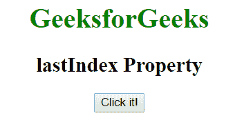
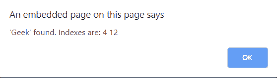

# JavaScript | lastIndex 属性

> 原文:[https://www . geesforgeks . org/JavaScript-last index-property/](https://www.geeksforgeeks.org/javascript-lastindex-property/)

JavaScript 中的 **lastIndex 属性**用于指定*开始下一场比赛*的索引。如果“g”修饰符不存在，这个属性将不起作用。
可以用来在上一场比赛结束后立即返回角色的位置。

**语法:**

```
RegexObj.lastIndex
```

**示例-1:** 本示例检查字符串中是否包含**“极客”**。

```
<!DOCTYPE html>
<html>

<head>
    <title>
      lastIndex Property
  </title>
</head>

<body style="text-align:center">
    <h1 style="color:green">
      GeeksforGeeks
  </h1>
    <h2>
      lastIndex Property
  </h2>
    <button onclick="geek()">
      Click it!
  </button>

    <script>
        function geek() {
            var str = 
                "GeeksforGeeks is the"+
                " computer science portal"+
                " for geeks";

            var patt1 = /Geek/g;
            var ans = "'Geek' found. Indexes are: ";
            // check "geek" in string.
            while (patt1.test(str) == true) {
                ans += patt1.lastIndex + " ";
            }
            alert(ans);
        }
    </script>
</body>

</html>
```

**输出:**
**点击按钮前:**

**点击按钮后:**


**示例-2:** 本示例检查字符串中是否包含**“ABC”**。

```
<!DOCTYPE html>
<html>

<head>
    <title>
      lastIndex Property
  </title>
</head>

<body style="text-align:center">
    <h1 style="color:green">
      GeeksforGeeks
  </h1>
    <h2>lastIndex Property</h2>
    <button onclick="geek()">
      Click it!
  </button>

    <script>
        function geek() {
            var str = 
                "GeeksforGeeks is"+
                " the computer science"+
                " portal for geeks";

            var patt1 = /abc/g;
            var ans = 
                "'Geek' found. Indexes are: ";
            var ans1 = 
                "'Geek' found. Indexes are: ";
            var len = ans.length;

            // check "geek" in string.
            while (patt1.test(str) == true) {
                ans1 += patt1.lastIndex + " ";
            }
            var x = ans1.length;
            if (len === x)
                alert("RegExp is not "+
                      "present in the string.");
            else
                alert(ans1);
        }
    </script>
</body>

</html>
```

**输出:**
**点击按钮前:**

**点击按钮后:**


**支持的浏览器:**JavaScript last index Property 支持的浏览器如下:

*   谷歌 Chrome
*   苹果 Safari
*   Mozilla Firefox
*   歌剧
*   微软公司出品的 web 浏览器