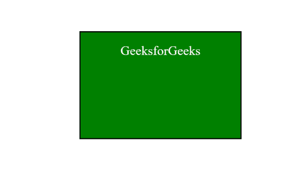
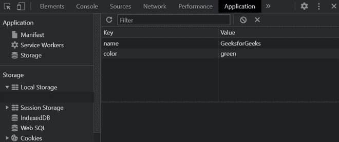
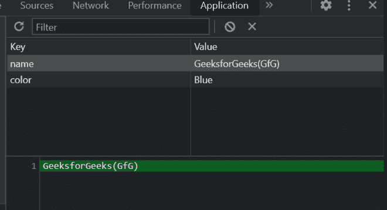
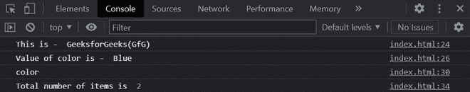
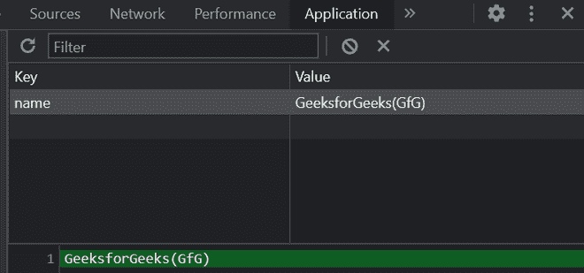
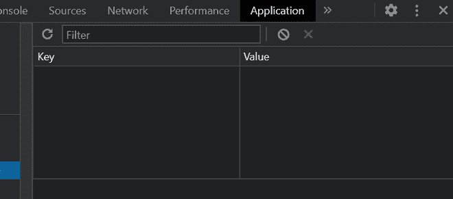

# JavaScript localStorage

> 原文:[https://www.geeksforgeeks.org/javascript-localstorage/](https://www.geeksforgeeks.org/javascript-localstorage/)

[**JavaScript**](https://www.geeksforgeeks.org/javascript-tutorial/) 是世界上最流行的轻量级、解释编译编程语言之一。是**同步**和**单线程。**在 **JavaScript** 中，程序被称为**脚本**。这些脚本以纯文本形式执行。我们可以直接将它们写在我们的 HTML 页面上，或者使用外部的 Javascript 文件。 **JavaScript** 可以在浏览器中执行，也可以在服务器上执行，或者实际上在任何具有名为 [JavaScriptengine](https://www.geeksforgeeks.org/introduction-to-javascript-engines/) 的特殊程序的设备上执行。JavaScript 用于**客户端**和**服务器端**开发。

**HTML DOM Window local storage**由 Browser 提供，它允许我们在网页浏览器中使用对象将数据存储为键值对。本地存储是窗口界面的*只读属性*。

数据存储为键值对，键是*唯一的*。键和值总是以存储在本地存储*中的 UTF-16 DOM 字符串格式。*

**local storage 的主要特点是:**

1.  存储是原点(域)有界的。
2.  即使浏览器关闭甚至操作系统重启，数据也不会被删除，直到我们手动清除浏览器的本地存储，数据才可用。

**语法:**

```
ourStorage = window.localStorage;
```

上面将返回一个*存储*对象，该对象可用于访问当前原点的本地存储空间。

**localStorage** 对象提供的属性和方法:

*   **设置项(**键，值 **):** 存储键/值对
*   **getItem(** 键 **):** 返回键前的值
*   **键(**索引 **):** 获取给定索引的键
*   **长度:**返回存储项目(数据)的数量
*   **移除项(**键 **):** 移除给定键及其值
*   **清除():**从存储器中删除所有内容

**示例:**以下代码片段访问当前域的**本地存储**对象。

## 超文本标记语言

```
<!DOCTYPE html>
<html lang="en">

<head>
    <meta charset="UTF-8">
    <meta http-equiv="X-UA-Compatible" 
        content="IE=edge">
    <meta name="viewport" content=
        "width=device-width, initial-scale=1.0">
    <title>JavaScript localStorage</title>

    <style>
        div {
            width: 300px;
            height: 200px;
            padding: 20px;
            border: 2px solid black;
            background-color: green;
            color: white;
            margin: auto;
            text-align: center;
            font-size: 1.5rem;
        }

        .box {
            box-sizing: border-box;
        }
    </style>
</head>

<body>

    <div class="box">GeeksforGeeks</div>

    <script>

        // Saving data as key/value pair
        localStorage.setItem("name", "GeeksforGeeks");
        localStorage.setItem("color", "green");

        // Updating data
        localStorage.setItem("name", "GeeksforGeeks(GfG)");
        localStorage.setItem("color", "Blue");

        // Get the data by key
        let name = localStorage.getItem("name");
        console.log("This is - ", name);
        let color = localStorage.getItem("color");
        console.log("Value of color is - ", color);

        // Get key on a given position
        let key1 = localStorage.key(1);
        console.log(key1);

        // Get number of stored items
        let items = localStorage.length;
        console.log("Total number of items is ", items);

        // Remove key with its value
        localStorage.removeItem("color");

        // Delete everything
        localStorage.clear();
    </script>
</body>

</html>
```

**输出:**



**注意:**要在浏览器的本地存储中查看数据，请执行以下操作。

1.  在浏览器中打开您的代码。
2.  右键单击并单击检查。
3.  然后转到工具栏上的应用程序选项卡。

*   ***将数据保存为键/值对***



*   ***更新数据***



*   ***获取数据、一键索引*** 、 ***和存储项目数***



*   ***移除带值的钥匙***



*   ***删除存储中的所有内容***

