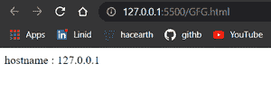
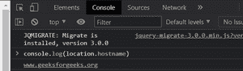
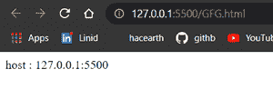

# JavaScript location . host vs location . hostname

> 原文:[https://www . geesforgeks . org/JavaScript-location-host-vs-location-hostname/](https://www.geeksforgeeks.org/javascript-location-host-vs-location-hostname/)

在本文中，我们将了解如何获取与网页相关的信息，如主机名、端口号等。我们还将看到 location.hostname 和 location.host 之间的区别。

**位置**对象用于获取当前网页的信息。**主机**和**主机名**是**位置**对象的属性。

**location.hostname:** 该属性将返回网页的域名。

**语法:**

```
location.hostname
```

**返回值:**返回代表域名或 IP 地址的字符串。

**示例:**

*   如果这是我们的网址，

    ```
    https://www.geeksforgeeks.org:8080/ds/heap
    ```

*   当我们调用 **location.hostname 时，**将返回。

    ```
    www.geeksforgeeks.org
    ```

## 超文本标记语言

```
<!DOCTYPE html>
<html lang="en">
  <head>

    <!-- using jquery library -->
    <script src=
"https://code.jquery.com/jquery-git.js">
    </script>
  </head>

  <body>
    <script>
      document.write("hostname : " + location.hostname);
    </script>
  </body>
</html>
```

**输出:**



为了验证任何网页的这个东西，打开你想要的网页，然后点击检查，然后在控制台标签中写下**console . log(location . hostname)**。你会得到网页的域名。



**location.host:** 该属性也返回相同的主机名，但也包括**端口号。**在这种情况下，如果端口号不可用，那么它只会返回主机名。

**语法:**

```
location.host
```

**返回值:**返回一个代表域名和端口号的字符串。

**示例:**

*   如果这是我们的网址，

    ```
    https://www.geeksforgeeks.org:8080/ds/heap
    ```

*   当我们调用 **location.host** 时，这将返回。

    ```
    www.geeksforgeeks.org:8080
    ```

## 超文本标记语言

```
<!DOCTYPE html>
<html lang="en">
  <head>
    <!-- using jquery library -->
    <script src=
"https://code.jquery.com/jquery-git.js">
    </script>
  </head>

  <body>
    <script>
      document.write("host : " + location.host);
    </script>
  </body>
</html>
```

**输出:**



<figure class="table">T29T31】Ex:www.abc.comT33】Ex:www.abc.com:8080T35T37T39
T41】

| 位置。主机名 | 位置。宿主 |
| --- | --- |
| It is an attribute of a location object. | Is also an attribute of the location object. |
| Returns the domain name of the current web page. | Returns the domain name and port number of the current web page, if any. |
| The return value is a string type. | The return value is a string type. |

</figure>