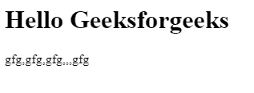

# JavaScript 逻辑与赋值(& & =)运算符

> 原文:[https://www . geesforgeks . org/JavaScript-逻辑和赋值运算符/](https://www.geeksforgeeks.org/javascript-logical-and-assignment-operator/)

该运算符由 **x & & = y，**表示，称为逻辑**和赋值**运算符。只有当 **x** 是**真值** 时，它才会将 **y** 的值赋值为 **x** 。

我们这样使用这个运算符 **x & & = y** 。现在把这个表达式分成两部分， **x & & (x = y)** 。如果 x 的值是真，那么语句**(x = y)** 执行，并且 **y** 的值被存储到 **x** 中，但是如果 **x** 的值是 **falsy** 值，那么语句 **(x = y)**

**语法:**

```
x &&= y
```

相当于

```
x && (x = y)
```

**示例:**

## java 描述语言

```
<script>
  let name = {
    firstName: "Ram",
    lastName: "",
  };

  console.log(name.firstName);

  // Changing the value using logical
  // AND assignment operator
  name.firstName &&= "Shyam";

  // Here the value changed because
  // name.firstName is truthy
  console.log(name.firstName);

  console.log(name.lastName);

  // Changing the value using logical 
  // AND assignment operator
  name.lastName &&= "Kumar";

  // Here the value remains unchanged 
  // because name.lastName is falsy
  console.log(name.lastName);
</script>
```

**输出:**

```
"Ram"
"Shyam"
""
""
```

**例 2:**

## 超文本标记语言

```
<!DOCTYPE html>
<html>

<body>
  <h1>Hello Geeksforgeeks</h1>
  <p id="print_arr"></p>

  <script>

      let arr = [1, 2, "apple", null, undefined, []]

      // Replace each truthy values with "gfg"

      arr.forEach((item, index)=>{
        arr[index] &&= "gfg"
    })

    document.getElementById("print_arr").innerText = arr.toString();
    //console.log(arr)
  </script>

</body>
</html>
```

**输出:**



**支持的浏览器:**

*   铬 85
*   边缘 85
*   Firefox 79
*   Safari 14