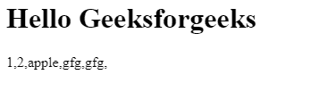

# JavaScript 逻辑或赋值(||=)运算符

> 原文:[https://www . geesforgeks . org/JavaScript-逻辑或赋值-运算符/](https://www.geeksforgeeks.org/javascript-logical-or-assignment-operator/)

该运算符由 **x ||= y** 表示，称为逻辑或赋值运算符。如果 **x** 的值为**假**，则 **y** 的值将分配给 **x.**

当我们把它分成两部分时，它就变成了 **x || ( x = y)。**

它检查 **x** 是真还是假，如果 **x** 的值是 **falsy** ，那么它运行 **( x = y )** 块，并且 **y** 的值被存储到 **x** 中，如果 x 的值是真的，那么下一个块 **( x = y )** 的值不执行

**语法:**

```
x ||= y
```

相当于

```
x || (x = y)
```

**例 1:**

## java 描述语言

```
<script>
  let name = {
    firstName: "Ram",
    lastName: "",
  };

  console.log(name.firstName);

  // Changing the value using logical
  // OR assignment operator
  name.firstName ||= "Shyam";

  // But value does not change because
  // name.firstName is truthy
  console.log(name.firstName);

  console.log(name.lastName);

  // Changing the value using logical
  // OR assignment operator
  name.lastName ||= "Kumar";

  // The value changes because name.lastName is falsy
  console.log(name.lastName);
</script>
```

**输出:**

```
"Ram"
"Ram"
""
"Kumar"
```

**例 2 :**

## 超文本标记语言

```
<!DOCTYPE html>
<html>
<body>
  <h1>Hello Geeksforgeeks</h1>
  <p id="print_arr"></p>

  <script>

      let arr = [1, 2, "apple", null, undefined, []]
      // Replace each falsy values with "gfg"
      arr.forEach((item, index)=>{
        arr[index] ||= "gfg"
    })

    document.getElementById("print_arr").innerText = arr.toString();

  </script>

</body>
</html>
```

**输出:**



**支持的浏览器:**

*   铬 85
*   边缘 85
*   Firefox 79
*   Safari 14