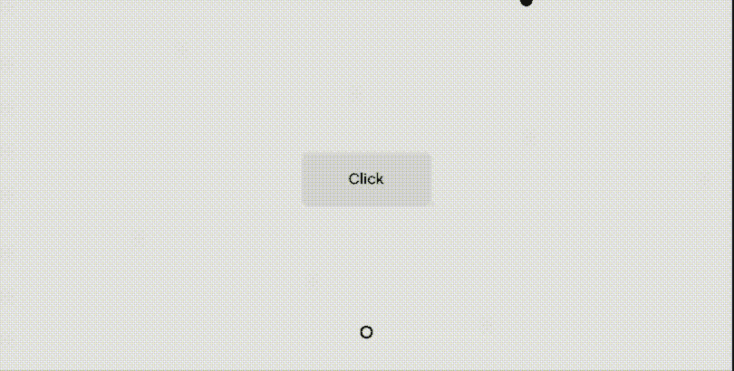
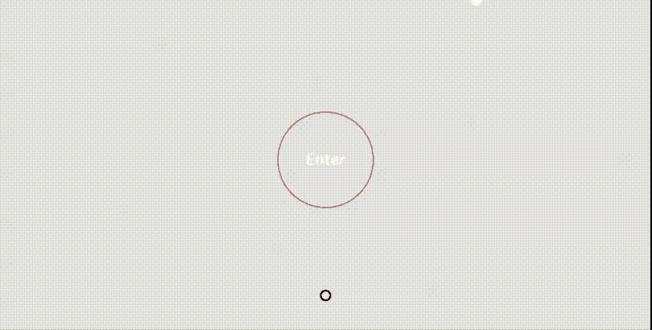
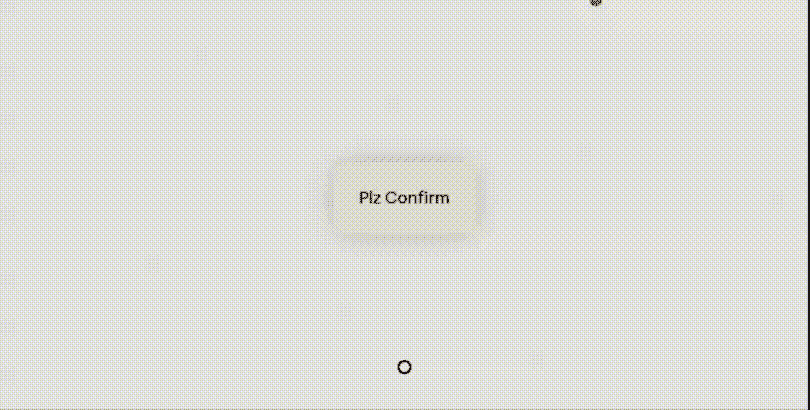
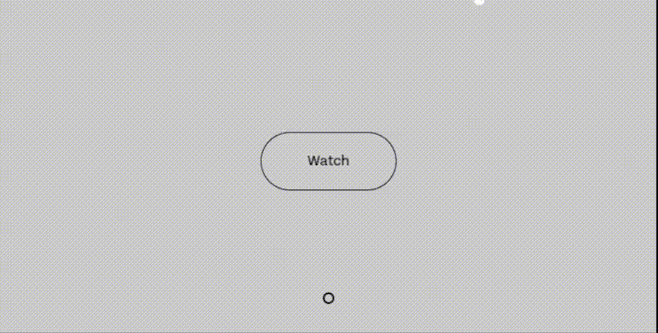
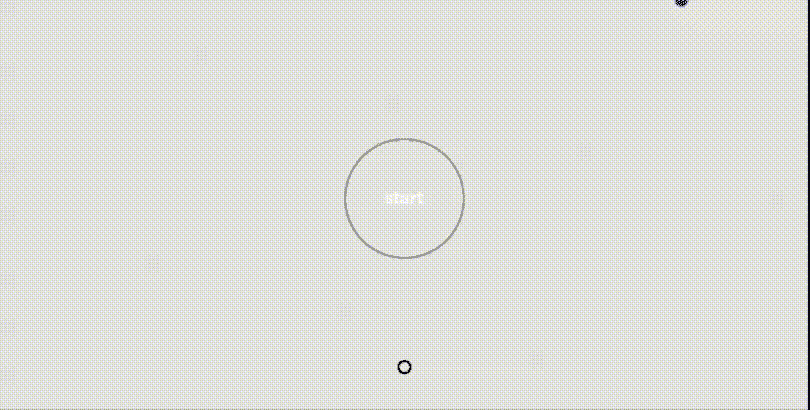
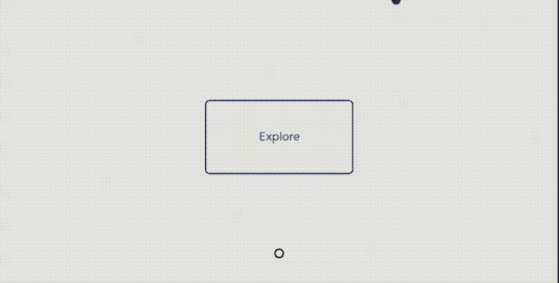

# JavaScript 磁控按钮插件

> 哎哎哎::1230【https://www . geeksforgeeks . org/JavaScript-magnetic buttons 插件/

**磁性按钮:**这些按钮是磁性的，当鼠标指针悬停在其上时，它们会跟随鼠标指针。这些按钮在网页中用于各种用户界面目的。

**注意:**请下载基于 JavaScript 的 [**磁性按钮**](https://github.com/codrops/MagneticButtons/) 插件，并将其保存在您的工作文件夹中，并将相关文件包含在您的 HTML 代码的头部，如下例所示。

> <链接 href = " base . 98 FD 6c 19 . CSS " rel = " style sheet " type = " text/CSS "/><链接 href = " button . f89 f 9832 . CSS " rel = " style sheet " type = " text/CSS "/><脚本 src= "中

**例 1:**

```
<!DOCTYPE html>
<html lang="en" class="no-js">

<head>
    <meta charset="UTF-8">
    <meta name="viewport" content=
        "width=device-width, initial-scale=1">

    <link rel="stylesheet" href="
        https://use.typekit.net/jpv1bvw.css">
    <link rel="stylesheet" type="text/css" href="
        base.98fd6c19.css">
    <link rel="stylesheet" type="text/css" href="
        button.f89f9832.css">
</head>

<body class="demo-1">
    <main>
        <div class="content">
            <button class="button">
                <span class="button__text">
                    <span class=
                        "button__text-inner">
                        Click
                    </span>
                </span>
            </button>
        </div>
        <nav class="demos">
            <a href="index.html" class=
                "demo demo--current" aria-label="">
            </a>
        </nav>
    </main>
    <svg class="cursor" width="25" 
        height="25" viewBox="0 0 25 25">
        <circle class="cursor__inner" 
            cx="12.5" cy="12.5" r="6.25">
        </circle>
    </svg>
    <script src="demo.9ce5c2ea.js"></script>
    <script src="demo1.151408fb.js"></script>
</body>

</html>
```

**输出:**


**示例 2:** 请在您的代码中包含以下文件，以便其工作。

> <src = " demo 2.44794 D1 a . js "></script>

```
<!DOCTYPE html>
<html lang="en" class="no-js">

<head>
    <meta charset="UTF-8">
    <meta name="viewport" content="
        width=device-width, initial-scale=1">

    <link rel="stylesheet" href="
        https://use.typekit.net/jpv1bvw.css">
    <link rel="stylesheet" type="text/css" href="
        button.5d2fdfe7.css">
    <link rel="stylesheet" type="text/css" href="
        base.98fd6c19.css">
</head>

<body class="demo-2">
    <main>
        <div class="content">
            <button class="button">
                <div class="button__deco">
                    <div class=
                        "button__deco-filler">
                    </div>
                </div>
                <span class="button__text">
                    <span class=
                        "button__text-inner">
                        Enter
                    </span>
                </span>
            </button>
        </div>
        <nav class="demos">
            <a href="myindex2.html" 
                class="demo demo--current" 
                aria-label="">
            </a>
        </nav>
    </main>
    <svg class="cursor" width="25" 
        height="25" viewBox="0 0 25 25">
        <circle class="cursor__inner" 
            cx="12.5" cy="12.5" r="6.25">
        </circle>
    </svg>
    <script src="demo2.44794d1a.js"></script>
    <script src="demo.9ce5c2ea.js"></script>

</body>

</html>
```

**输出:**


**例 3:** 请包含以下文件。

> <src = " demo 3 . b 516845 c . js "></script>

```
<!DOCTYPE html>
<html lang="en" class="no-js">

<head>
    <meta charset="UTF-8">
    <meta name="viewport" content="
        width=device-width, initial-scale=1">

    <link rel="stylesheet" href="
        https://use.typekit.net/jpv1bvw.css">
    <link rel="stylesheet" type="text/css" href="
        button.93b3ed9d.css">
    <link rel="stylesheet" type="text/css" href="
        base.98fd6c19.css">
</head>

<body class="demo-3">
    <main>
        <div class="content">
            <button class="button">
                <span class="button__text">
                    <span class=
                    "button__text-inner">
                    Plz Confirm
                    </span>
                </span>
            </button>
        </div>
        <nav class="demos">
            <a href="index3.html" 
                class="demo demo--current" 
                aria-label="Demo 3">
            </a>
        </nav>
    </main>
    <svg class="cursor" width="25" 
        height="25" viewBox="0 0 25 25">
        <circle class="cursor__inner" 
            cx="12.5" cy="12.5" r="6.25">
        </circle>
    </svg>
    <script src="demo3.b516845c.js"></script>
    <script src="demo.9ce5c2ea.js"></script>
</body>

</html>
```

**输出:**


**例 4:** 请包含以下文件。

> <link href="”button.9ccad82e.css”" rel="”stylesheet”<br/">类型="text/css"/ >
> <脚本 src = " demo 4 . e2d 7780 . js "></脚本>

```
<!DOCTYPE html>
<html lang="en" class="no-js">

<head>
    <meta charset="UTF-8">
    <meta name="viewport" content="
        width=device-width, initial-scale=1">

    <link rel="stylesheet" href="
        https://use.typekit.net/jpv1bvw.css">
    <link rel="stylesheet" type="text/css" href="
        base.98fd6c19.css">
    <link rel="stylesheet" type="text/css" href="
        button.9ccad82e.css">

</head>

<body class="demo-4">
    <main>
        <div class="content">
            <button class="button">
                <div class="button__filler"></div>
                <span class="button__text">
                    <span class=
                        "button__text-inner">
                        Watch
                    </span>
                </span>
            </button>
        </div>
        <nav class="demos">
            <a href="myindex4.html" 
                class="demo demo--current" 
                aria-label="">
            </a>
        </nav>
    </main>
    <svg class="cursor" width="25" 
        height="25" viewBox="0 0 25 25">
        <circle class="cursor__inner" 
            cx="12.5" cy="12.5" r="6.25">
        </circle>
    </svg>
    <script src="demo4.e22d7780.js"></script>
    <script src="demo.9ce5c2ea.js"></script>
</body>

</html>
```

**输出:**


**例 5:** 请包含以下文件。

> <link href="”button.b160bf58.css”" rel="”stylesheet”<br/">类型="text/css"/ >
> <脚本 src = " demo 5 . C1 b42 ce 3 . js "></脚本>

```
<!DOCTYPE html>
<html lang="en" class="no-js">

<head>
    <meta charset="UTF-8">
    <meta name="viewport" content="
        width=device-width, initial-scale=1">

    <link rel="stylesheet" type="text/css" 
        href="button.b160bf58.css">
    <link rel="stylesheet" type="text/css" 
        href="base.98fd6c19.css">
    <link rel="stylesheet" href="
        https://use.typekit.net/jpv1bvw.css">
</head>

<body class="demo-2">
    <main>
        <div class="content">
            <button class="button">
                <div class="button__deco 
                    button__deco--2">
                </div>
                <div class="button__deco 
                    button__deco--1">
                </div>
                <span class="button__text">
                    <span class=
                        "button__text-inner">
                        start
                    </span>
                </span>
            </button>
        </div>
        <nav class="demos">
            <a href="index5.html" 
                class="demo demo--current" 
                aria-label="">
            </a>
        </nav>
    </main>
    <svg class="cursor" width="25" 
        height="25" viewBox="0 0 25 25">
        <circle class="cursor__inner" 
            cx="12.5" cy="12.5" r="6.25">
        </circle>
    </svg>
    <script src="demo5.c1b42ce3.js"></script>
    <script src="demo.9ce5c2ea.js"></script>
</body>

</html>
```

**输出:**


**例 6:** 请包含以下文件。

> <link href="”button.bc1eb4ce.css”" rel="”stylesheet”<br/">type = " text/CSS "/>
> <script src = " demo 6 . a 93520 db . js "></script>

```
<!DOCTYPE html>
<html lang="en" class="no-js">

<head>
    <meta charset="UTF-8">
    <meta name="viewport" content="
        width=device-width, initial-scale=1">

    <link rel="stylesheet" type="text/css" href="
        button.bc1eb4ce.css">
    <link rel="stylesheet" href="
        https://use.typekit.net/jpv1bvw.css">
    <link rel="stylesheet" type="text/css" href="
        base.98fd6c19.css">
</head>

<body class="demo-4">
    <main>
        <div class="content">
            <div class="button-wrap">
                <button class="button">
                    <div class="button__deco"></div>
                    <span class="button__text">
                        <span class=
                            "button__text-inner">
                            Explore
                        </span>
                    </span>
                </button>
            </div>
        </div>
        <nav class="demos">
            <a href="index6.html" 
                class="demo demo--current" 
                aria-label=""></a>
        </nav>
    </main>
    <svg class="cursor" width="25" 
        height="25" viewBox="0 0 25 25">
        <circle class="cursor__inner" 
            cx="12.5" cy="12.5" r="6.25">
        </circle>
    </svg>
    <script src="demo6.a93520db.js"></script>
    <script src="demo.9ce5c2ea.js"></script>
</body>

</html>
```

**输出:**
