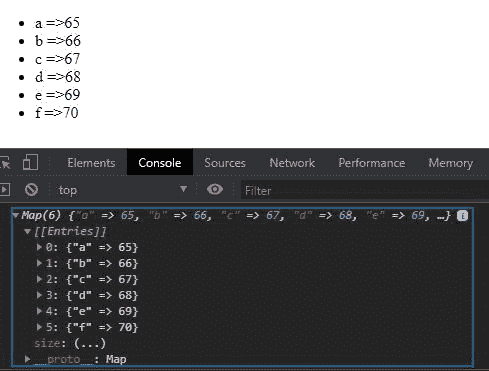

# JavaScript 映射 forEach()方法

> 原文:[https://www . geesforgeks . org/JavaScript-map-foreach-method/](https://www.geeksforgeeks.org/javascript-map-foreach-method/)

下面是 **Map.forEach()** 方法的例子

## java 描述语言

```
<script>
    // Creating a map using Map object
    let mp=new Map()

    // Adding values to the map
    mp.set("a",1);
    mp.set("b",2);
    mp.set("c",3);

    // Logging map object to console
    mp.forEach((values,keys)=>{
      document.write(values,keys+"<br>")
    })
</script>
```

**输出:**

```
1a
2b
3c

```

**Map.forEach** 方法用于使用给定函数在地图上循环，并在每个键值对上执行给定函数。

**语法:**

```
myMap.forEach(callback, value, key, thisArg)

```

**参数:**该方法接受上述和下述四个参数:

*   **回调:**这是每次函数调用时执行的函数。
*   **值:**这是每次迭代的值。
*   **键:**这是达到迭代的关键。
*   **thisArg:** 这是执行回调时用作这个的值。

**返回:**返回未定义的值。

上述方法的代码如下:
**程序 1:**

## 超文本标记语言

```
<script>

    // Creating a map using Map object
    let mp=new Map()

    // Adding values to the map
    mp.set("a",65);
    mp.set("b",66);
    mp.set("c",67);
    mp.set("d",68);
    mp.set("e",69);
    mp.set("f",70);

    // Logging map object
    document.write(mp+ "<br>");
    mp.forEach((values,keys)=>{
      document.write("values: ",values+
                     ", keys: ",keys+ "<br>")
    })
</script>
```

**输出:**

```
[object Map]
values: 65, keys: a
values: 66, keys: b
values: 67, keys: c
values: 68, keys: d
values: 69, keys: e
values: 70, keys: f
```

**程序 2:**

## 超文本标记语言

```
<!DOCTYPE html>
<html lang="en">
<head>
  <meta charset="UTF-8">
  <meta name="viewport" 
        content="width=device-width, 
                 initial-scale=1.0">
  <title>Document</title>
</head>
<body>
  <ul class="list">
  </ul>
  <script>
    // Creating a map using Map object
    let mp=new Map()
    //adding values to the map
    mp.set("a",65);
    mp.set("b",66);
    mp.set("c",67);
    mp.set("d",68);
    mp.set("e",69);
    mp.set("f",70);
    //logging map object to console
    document.log(mp);
    let ul=document.querySelector("ul");
    mp.forEach((values,keys)=>{
      ul.innerHTML+=ul.innerHTML="<li>"+keys+" =>"+values+"</li>"
    })
  </script>
</body>
</html>
```

**输出:**



**支持的浏览器:**

*   谷歌 Chrome
*   微软边缘
*   Mozilla Firefox
*   微软公司出品的 web 浏览器
*   旅行队
*   歌剧