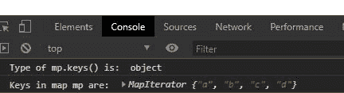
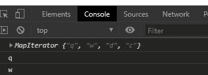

# JavaScript 贴图键()方法

> 原文:[https://www.geeksforgeeks.org/javascript-map-keys-method/](https://www.geeksforgeeks.org/javascript-map-keys-method/)

下面是 **Map.keys()** 方法的基本示例。

## java 描述语言

```
<script>
  let mp=new Map()
  mp.set("a",11);
  mp.set("b",2);
  mp.set("c",5);
  console.log(mp.keys());
</script>
```

**输出:**

```
MapIterator {"a", "b", "c"}

```

**Map.keys()** 方法用于从给定的映射对象中提取密钥，并返回密钥的迭代器对象。密钥按照插入的顺序返回。

**语法:**

```
Map.keys()

```

**参数:**此方法不接受任何参数。

**返回:**返回包含映射中键的迭代器对象。

上述方法的代码如下:
**程序 1:**

## 超文本标记语言

```
<!DOCTYPE html>
<html lang="en">
<head>
  <meta charset="UTF-8">
  <meta name="viewport" 
        content="width=device-width,
                 initial-scale=1.0">
  <title>Document</title>
</head>
<body>
  <ul class="list">
  </ul>
  <script>
    // Creating a map using Map object
    let mp=new Map()
    // Adding key value pairs to the map mp
    mp.set("a",1);
    mp.set("b",2);
    mp.set("c",22);
    mp.set("d",12);
    console.log("Type of mp.keys() is: ",typeof (mp.keys()));
    console.log("Keys in map mp are: ",mp.keys());
  </script>
</body>
</html>
```

**输出:**

[](https://media.geeksforgeeks.org/wp-content/uploads/20200713000952/01.JPG)

**程序 2:** 更新地图中的键值，并使用迭代器对象打印值。

## 超文本标记语言

```
<!DOCTYPE html>
<html lang="en">
<head>
  <meta charset="UTF-8">
  <meta name="viewport" 
        content="width=device-width,
                 initial-scale=1.0">
  <title>Document</title>
</head>
<body>
  <ul class="list">
  </ul>
  <script>
    // Creating a map using Map object
    let mp=new Map()
    // Adding key value pairs to the map mp
    mp.set("q",1);
    mp.set("w",2);
    // Value of key "q" is updated to 22
    mp.set("q",22);
    mp.set("d",22);
    mp.set("c",12);
    let it=mp.keys();
    // Logginfg iterator object
    console.log(it);
    console.log(it.next().value)
    // Iterator pointing to next key and 
    // printing the value
    console.log(it.next().value)
  </script>
</body>
</html>
```

**输出:**



**支持的浏览器:**

*   铬
*   歌剧
*   边缘
*   火狐浏览器
*   旅行队