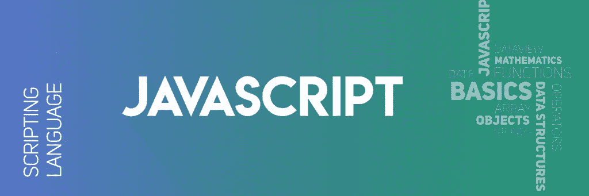
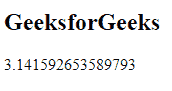

# JavaScript |数学对象完整参考

> 原文:[https://www . geesforgeks . org/JavaScript-math-object-complete-reference/](https://www.geeksforgeeks.org/javascript-math-object-complete-reference/)



数学对象用于对数字进行数学运算。

**示例:**

```
<!DOCTYPE html>
<html>
    <body>
        <h2>GeeksforGeeks</h2>

        <script>
// Return PI value(3.141592653589793)
            document.write(Math.PI);
        </script>
    </body>
</html>
```

**输出:**


JavaScript 中有许多数学对象属性和方法，如下所示:

**数学对象属性:**

*   [JavaScript |数学。e()功能](https://www.geeksforgeeks.org/javascript-math-e-function/)
*   [JavaScript |数学。LN2 属性](https://www.geeksforgeeks.org/javascript-math-ln2-property/)
*   [JavaScript |数学。LN10 属性](https://www.geeksforgeeks.org/javascript-math-ln10-property/)
*   [JavaScript |数学。LOG2E 属性](https://www.geeksforgeeks.org/javascript-math-log2e-property/)

*   [JavaScript |数学。LOG10E 属性](https://www.geeksforgeeks.org/javascript-math-log10e-property/)
*   [JavaScript |数学。PI 属性](https://www.geeksforgeeks.org/javascript-math-pi-property/)
*   [JavaScript |数学。SQRT1_2 属性](https://www.geeksforgeeks.org/javascript-math-sqrt1_2-property/)
*   [JavaScript |数学。SQRT2 属性](https://www.geeksforgeeks.org/javascript-math-sqrt2-property/)

**数学对象方法:**

*   [Javascript | Math.abs()](https://www.geeksforgeeks.org/javascript-math-abs-function/)
*   [Javascript | Math.acos()](https://www.geeksforgeeks.org/math-acos-javascript/)
*   [Javascript | Math.acosh()](https://www.geeksforgeeks.org/math-acosh-javascript/)
*   [Javascript | Math.asin()](https://www.geeksforgeeks.org/math-asin-javascript/)
*   [Javascript | Math.asinh()](https://www.geeksforgeeks.org/math-asinh-javascript/)
*   [Javascript | Math.atan()](https://www.geeksforgeeks.org/math-atan-javascript/)
*   [Javascript | Math.atan2()](https://www.geeksforgeeks.org/javascript-math-atan2/)
*   [Javascript | Math.atanh()](https://www.geeksforgeeks.org/math-atanh-javascript/)
*   [Javascript | Math.cbrt()](https://www.geeksforgeeks.org/javascript-math-cbrt-function/)
*   [Javascript | Math.ceil()](https://www.geeksforgeeks.org/javascript-math-ceil-function/)
*   [Javascript |型号.clz32（）](https://www.geeksforgeeks.org/javascript-math-clz32-function/)
*   [Javascript | Math.cos()](https://www.geeksforgeeks.org/math-cos-javascript/)
*   [Javascript | Math.cosh()](https://www.geeksforgeeks.org/javascript-math-cosh-function/)
*   [Javascript | Math.exp()](https://www.geeksforgeeks.org/math-exp-javascript/)
*   [Javascript | Math.expm1()](https://www.geeksforgeeks.org/javascript-math-expm1-function/)
*   [Javascript | Math.floor()](https://www.geeksforgeeks.org/javascript-math-floor-function/)
*   [Javascript | Math.fround()](https://www.geeksforgeeks.org/javascript-math-fround-function/)
*   [Javascript | math . hypt()](https://www.geeksforgeeks.org/javascript-math-hypot-function/)

*   [Javascript |数学.imul（）](https://www.geeksforgeeks.org/javascript-math-imul-function/)
*   [Javascript | Math.log()](https://www.geeksforgeeks.org/math-log-javascript/)
*   [JavaScript | Math.log1p()](https://www.geeksforgeeks.org/javascript-math-log1p/)
*   [Javascript | Math.log2()](https://www.geeksforgeeks.org/javascript-math-log2-function/)
*   [Javascript | Math.log10()](https://www.geeksforgeeks.org/javascript-math-log10-function/)
*   [Javascript | Math.max()](https://www.geeksforgeeks.org/math-max-javascript/)
*   [Javascript | Math.min()](https://www.geeksforgeeks.org/math-min-javascript/)
*   [Javascript | Math.pow()](https://www.geeksforgeeks.org/javascript-math-pow-function/)
*   [Javascript | Math.random()](https://www.geeksforgeeks.org/javascript-math-random-function/)
*   [JavaScript | Math.round( )](https://www.geeksforgeeks.org/javascript-math-round-function/)
*   [Javascript | Math.sign( )](https://www.geeksforgeeks.org/javascript-math-sign-function/)
*   [Javascript | Math.sin()](https://www.geeksforgeeks.org/math-sin-javascript/)
*   [Javascript | Math.sinh()](https://www.geeksforgeeks.org/javascript-math-sinh-function/)
*   [JavaScript | Math.sqrt( )](https://www.geeksforgeeks.org/javascript-math-sqrt-function/)
*   [Javascript | Math.tan()](https://www.geeksforgeeks.org/math-tan-javascript/)
*   [Javascript | Math.tanh()](https://www.geeksforgeeks.org/javascript-math-tanh-function/)
*   [Javascript | Math.trunc()](https://www.geeksforgeeks.org/javascript-math-trunc-function/)