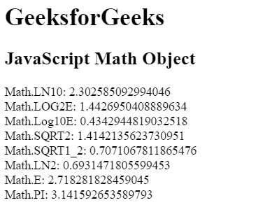
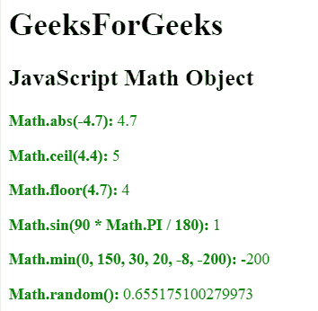

# JavaScript |数学对象

> 原文:[https://www.geeksforgeeks.org/javascript-math-object/](https://www.geeksforgeeks.org/javascript-math-object/)

**数学对象**用于对数字进行数学运算。下面列出了许多数学对象属性:

| 财产 | 描述 |
| 数学。E | 欧拉数 |
| 数学。产品改进(Product Improve) | 产品改进(Product Improve) |
| Math.SQRT2 | 2 的平方根 |
| Math.SQRT1_2 | 1/2 的平方根 |
| 型号：LN2 | 2 的自然对数 |
| 型号：LN10 | 10 的自然对数 |
| 数学。LOG2E | E 的以 2 为底的对数 |
| 数学。LOG10E | E 的以 10 为底的对数 |

**数学对象:**JavaScript 中存在很多数学对象，列举如下:

| 财产 | 描述 |
| abs(x) | x 的绝对值 |
| acos(x) | x 的反余弦，单位为弧度 |
| asin(x) | x 的反正弦，单位为弧度 |
| 阿坦(x) | x 的反正切，介于-π/2 和π/2 弧度之间的数值 |
| atan2(y，x) | 其参数商的反正切 |
| 天花板(x) | x 的值向上舍入到最接近的整数 |
| cos(x) | x 的余弦值(以弧度表示的 x) |
| exp() | E^x 的价值 |
| 楼层() | x 的值四舍五入到最接近的整数 |
| 日志() | x 的自然对数(以 E 为底) |
| 最大值(a，b，…) | 最高值 |
| 最小值(a，b，…) | 最低值 |
| 功率(x，y) | x 的值与 y 的幂 |
| 随机() | 介于 0 和 1 之间的随机数 |
| 圆形(x) | x 的值四舍五入到最接近的整数 |
| sin(x) | x 的正弦值(以弧度表示的 x) |
| sqrt(x) | x 的平方根 |
| 棕褐色(x) | 角度正切 |

**示例 1:** 本示例使用数学对象属性来返回它们的值。

```
<!DOCTYPE html> 
<html> 

<head> 
    <title> 
        JavaScript Math Object
    </title> 
</head> 

<body> 

    <h1>GeeksforGeeks</h1> 

    <h2>JavaScript Math Object</h2> 

    <p id="GFG"></p>

    <!-- Script to return math property values -->    
    <script> 
        document.getElementById("GFG").innerHTML = 
            "Math.LN10: " + Math.LN10 + "<br>" +
            "Math.LOG2E: " + Math.LOG2E + "<br>" +
            "Math.Log10E: " + Math.LOG10E + "<br>" +
            "Math.SQRT2: " + Math.SQRT2 + "<br>" +
            "Math.SQRT1_2: " + Math.SQRT1_2 + "<br>" +
            "Math.LN2: " + Math.LN2 + "<br>" +
            "Math.E: " + Math.E + "<br>" +
            "Math.PI: " + Math.PI;
    </script> 
</body> 

</html>                    
```

**输出:**


**示例 2:** 本示例中使用了数学对象方法。

```
<!DOCTYPE html> 
<html> 

<head> 
    <title> 
        JavaScript Math Object
    </title> 
</head> 

<body> 

    <h1>GeeksForGeeks</h1> 

    <h2>JavaScript Math Object</h2> 

    <p id="GFG" style = "color:green;"></p>

    <!-- Script to use math object method -->    
    <script> 
        document.getElementById("GFG").innerHTML = 
        "<p><b>Math.abs(-4.7):</b> " + Math.abs(-4.7) + "</p>" +
        "<p><b>Math.ceil(4.4):</b> " + Math.ceil(4.4) + "</p>" +
        "<p><b>Math.floor(4.7):</b> " + Math.floor(4.7) + "</p>" +
        "<p><b>Math.sin(90 * Math.PI / 180):</b> " + 
                Math.sin(90 * Math.PI / 180) + "</p>" +
        "<p><b>Math.min(0, 150, 30, 20, -8, -200):</b> " +
                Math.min(0, 150, 30, 20, -8, -200) + "</p>" +
        "<p><b>Math.random():</b> " + Math.random() + "</p>";
    </script> 
</body> 

</html>                    
```

**输出:**
