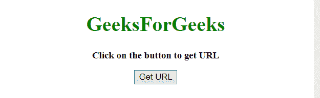
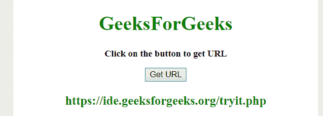

# JavaScript 方法获取无查询字符串的 URL

> 原文:[https://www . geesforgeks . org/JavaScript-method-to-get-URL-不带查询字符串/](https://www.geeksforgeeks.org/javascript-method-to-get-the-url-without-query-string/)

任务是在没有使用查询字符串的情况下，在 JavaScript 的帮助下获取页面的 URL 名称。

*   **replace() method:** This method searches a string for a defined value, or a regular expression, and returns a new string with the replaced defined value.

    **语法:**

    ```
    string.replace(searchVal, newvalue)
    ```

    **参数:**

    *   **搜索值:**此参数为必填项。它指定将被新值替换的值或正则表达式。
    *   **新值:**此参数为必填项。它指定要用搜索值替换的值。

    **返回值:**它返回一个新字符串，其中定义的值已被新值替换。

*   **split() method:** This method is used to split a string into an array of substrings, and returns the new array.

    **语法:**

    ```
    string.split(separator, limit)
    ```

    **参数:**

    *   **分隔符:**此参数为可选。它指定用于拆分字符串的字符或正则表达式。如果不使用，将返回整个字符串(只有一项的数组)。
    *   **极限:**此参数为可选。它指定指定拆分次数的整数，超出拆分限制的项目将从数组中排除。

    **返回值:**返回一个新数组，包含拆分后的项目。

**示例 1:** 本示例首先使用 **href** 提取页面的所有 URL，然后通过设置**索引= 0** 获取第一个 URL，然后删除**之后的部分？**采用**分裂()法**。

```
<!DOCTYPE HTML> 
<html> 
    <head> 
        <title> 
            JavaScript method to get the URL
            without query string
        </title>
    </head> 

    <body style = "text-align:center;"> 

        <h1 style = "color:green;" > 
            GeeksForGeeks 
        </h1>

        <p id = "GFG_UP" style = 
            "font-size: 15px; font-weight: bold;">
        </p>

        <button onclick = "GFG_click()">
            Get URL
        </button>

        <p id = "GFG_DOWN" style = 
            "color:green; font-size: 20px; font-weight: bold;">
        </p>

        <script>
            var el_up = document.getElementById("GFG_UP");
            var el_down = document.getElementById("GFG_DOWN");
            el_up.innerHTML = "Click on the button to get URL";

            function functionName(fun) {
                var val = fun.name;
                el_down.innerHTML = val;
            }
            function GFGFunction() {

            }
            function GFG_click() {
                el_down.innerHTML = window.location.href.split('?')[0];
            }         
        </script> 
    </body> 
</html>                    
```

**输出:**

*   **点击按钮前:**
    
*   **点击按钮后:**
    

**例 2:** 本例通过**替换()方法从**位置**将**位置搜索**替换为**空字符串**。**

```
<!DOCTYPE HTML> 
<html> 
    <head> 
        <title> 
            JavaScript method to get the URL
            without query string
        </title>
    </head> 

    <body style = "text-align:center;">

        <h1 style = "color:green;" > 
            GeeksForGeeks 
        </h1>

        <p id = "GFG_UP" style =
            "font-size: 15px; font-weight: bold;">
        </p>

        <button onclick = "GFG_click()">
            Get URL
        </button>

        <p id = "GFG_DOWN" style = 
            "color:green; font-size: 20px; font-weight: bold;">
        </p>

        <script>
            var el_up = document.getElementById("GFG_UP");
            var el_down = document.getElementById("GFG_DOWN");
            el_up.innerHTML = "Click on the button to get URL";

            function functionName(fun) {
                var val = fun.name;
                el_down.innerHTML = val;
            }
            function GFGFunction() {

            }
            function GFG_click() {
                el_down.innerHTML = 
                    location.toString().replace(location.search, "");
            }         
        </script> 
    </body> 
</html>                    
```

**输出:**

*   **点击按钮前:**
    
*   **点击按钮后:**
    