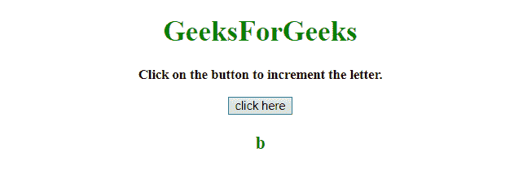
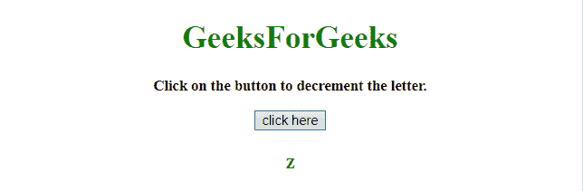
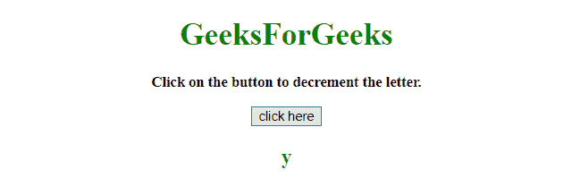

# 增加/减少字母的 JavaScript 方法

> 原文:[https://www . geesforgeks . org/JavaScript-methods-to-increment-减量-按字母顺序排列的字母/](https://www.geeksforgeeks.org/javascript-methods-to-increment-decrement-alphabetical-letters/)

任务是在 JavaScript 的帮助下，使用 ASCII 值递增/递减字母。

**进场:**

*   使用 charCodeAt()方法返回字符串中指定索引处的字符的 Unicode
*   根据需要增加/减少 ASCII 值。
*   使用 fromCharCode()方法将 Unicode 值转换为字符。

**例 1:** 在本例中，字符‘a’通过点击按钮递增。

```
<!DOCTYPE HTML> 
<html> 

<head> 
    <title> 
        JavaScript method to increment/
        decrement letters
    </title>
</head>

<body style = "text-align:center;">

    <h1 style = "color:green;"> 
        GeeksForGeeks 
    </h1>

    <p id = "GFG_UP" style = 
        "font-size: 15px; font-weight: bold;">
    </p>

    <button onclick = "GFG_Fun()">
        click here
    </button>

    <p id = "GFG_DOWN" style = 
        "color:green; font-size: 20px; font-weight: bold;">
    </p>

    <script> 
        var up = document.getElementById('GFG_UP');
        var down = document.getElementById('GFG_DOWN');

        up.innerHTML = "Click on the button to increment "
                    + "the letter.";
        down.innerHTML = 'a';

        function nextCharacter(c) {
            return String.fromCharCode(c.charCodeAt(0) + 1);
        }

        function GFG_Fun() {
            var c = down.innerHTML;
            down.innerHTML = nextCharacter(c);
        }
    </script> 
</body> 

</html>
```

**输出:**

*   **点击按钮前:**
    
*   **点击按钮后:**
    

**示例 2:** 在本例中，通过点击按钮来减少字符‘z’。

```
<!DOCTYPE HTML> 
<html> 

<head> 
    <title> 
        JavaScript method to increment/
        decrement letters
    </title>
</head>

<body style = "text-align:center;"> 

    <h1 style = "color:green;"> 
        GeeksForGeeks 
    </h1>

    <p id = "GFG_UP" style = 
        "font-size: 15px; font-weight: bold;">
    </p>

    <button onclick = "GFG_Fun()">
        click here
    </button>

    <p id = "GFG_DOWN" style = 
        "color:green; font-size: 20px; font-weight: bold;">
    </p>

    <script> 
        var up = document.getElementById('GFG_UP');
        var down = document.getElementById('GFG_DOWN');

        up.innerHTML = "Click on the button to decrement "
                    + "the letter.";
        down.innerHTML = 'z';

        function nextCharacter(c) {
            return String.fromCharCode(c.charCodeAt(0) - 1);
        }

        function GFG_Fun() {
            var c = down.innerHTML;
            down.innerHTML = nextCharacter(c);
        }
    </script> 
</body> 

</html>
```

**输出:**

*   **点击按钮前:**
    
*   **点击按钮后:**
    