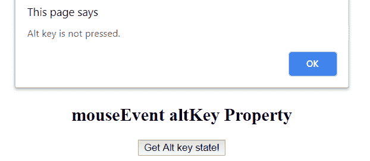
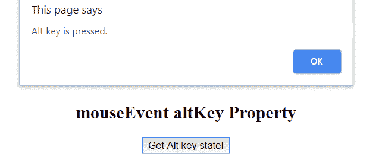

# Javascript | MouseEvent altKey 属性

> 原文:[https://www . geesforgeks . org/JavaScript-mouse event-altkey-property/](https://www.geeksforgeeks.org/javascript-mouseevent-altkey-property/)

**鼠标事件替代键**属性用于定义是否按下*替代*键。它是一个布尔值。当按下 alt 键，然后点击鼠标按钮，它返回真，如果没有按下，它返回假。

**语法:**

```
event.altKey
```

**返回值:**返回一个布尔值，表示是否按了 alt 键。

*   **真:**表示按了 alt 键
*   **假:**表示没有按 alt 键

**例:**

## 超文本标记语言

```
<!DOCTYPE html>

<html>

<body style="text-align:center;">

    <h1 style="color:green;">
        GeeksforGeeks
    </h1>

    <h2>
        mouseEvent altKey Property
    </h2>

    <button onclick="geek (event);">Get Alt key state!</button>
    <script>
        function geek(event) {
            if (event.altKey) {
                alert("Alt key is pressed.");
            } else {
                alert("Alt key is not pressed.");
            }
        }
    </script>
</body>

</html>
```

**输出:**
**点击按钮(Alt 键未按下):**



**点击按钮(按下 Alt 键):**



**支持的浏览器:**mouseEvent altKey Property 支持的浏览器如下:

*   苹果 Safari
*   谷歌 Chrome
*   火狐浏览器
*   歌剧
*   微软公司出品的 web 浏览器