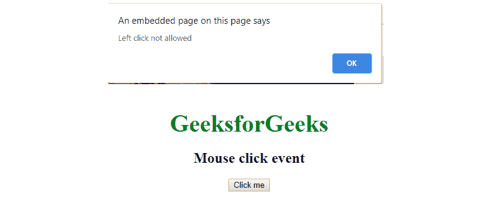
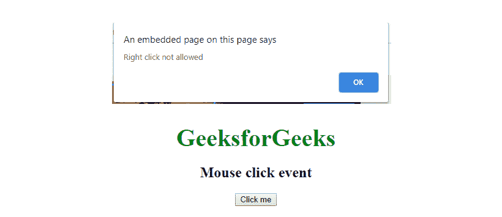

# JavaScript |鼠标事件按钮属性

> 原文:[https://www . geesforgeks . org/JavaScript-mouse event-button-property/](https://www.geeksforgeeks.org/javascript-mouseevent-button-property/)

MouseEvent 按钮属性用于定义左键或右键单击事件。当点击鼠标按钮时，它将返回一个描述鼠标左键、右键或中键的整数值。

**语法:**

```
event.button
```

**返回值:**此事件返回一个整数值鼠标点击事件有:

*   **0:** 表示鼠标左键。
*   **1:** 表示鼠标中键。
*   **2:** 表示鼠标右键。

**onmousedown 事件:**当用户在元素上按下鼠标按钮时，会发生此事件。

**程序 1:**

```
<!DOCTYPE html>
<html>
    <head>
        <title>JavaScript Mouse Event</title>
        <style>
            body {
                text-align:center;
            }
            .gfg {
                font-size:40px;
                font-weight:bold;
                color:green;
            }
        </style>
    </head>
    <body>
        <div class = "gfg">GeeksforGeeks</div>
        <h2>Mouse click event</h2>
        <button onclick="click(event)">Click me</button>
        <p id="demo"></p>
        <script>
            document.onmousedown = click

            // click function called
            function click(event) {

                // Condition to disable left click
                if (event.button == 0) {
                          alert("Left click not allowed");
                }
            }
        </script>
    </body>
</html>
```

**输出:**


**程序 2:**

```
<!DOCTYPE html>
<html>
    <head>
        <title>JavaScript Mouse Event</title>
        <style>
            body {
                text-align:center;
            }
            .gfg {
                font-size:40px;
                font-weight:bold;
                color:green;
            }
        </style>
    </head>
    <body>
        <div class = "gfg">GeeksforGeeks</div>
        <h2>Mouse click event</h2>
        <button onclick="click(event)">Click me</button>
        <p id="demo"></p>
        <script>
            document.onmousedown = click

            // click function called
            function click(event) {

                // Condition to disable left click
                if (event.button == 2) {
                          alert("Right click not allowed");
                }
            }
        </script>
    </body>
</html>
```

**输出:**
