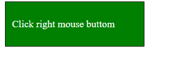
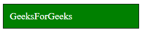

# JavaScript 上下文菜单 MouseEvent

> 哎哎哎:# t0]https://www . geeksforgeeks . org/JavaScript-mouse event-context menu-event/

当我们在桌面上单击鼠标右键时，会出现一个类似菜单的框，这个框称为上下文菜单。在 JavaScript 中，当用户试图打开上下文菜单时，会运行上下文菜单事件。这可以通过单击鼠标右键来完成。

本文演示了当我们单击鼠标右键时执行任何操作。例如，当我们单击鼠标右键时，我们想要更改框的背景颜色。

## 超文本标记语言

```
<!DOCTYPE html>
<html lang="en">
  <head>
    <meta charset="UTF-8" />
    <meta http-equiv="X-UA-Compatible"
          content="IE=edge" />
    <meta name="viewport"
          content="width=device-width, initial-scale=1.0" />
  </head>

  <!-- Adding some CSS -->
  <style>
    .context {
      border: 1px solid black;
      background: gREEN;
      width: 200px;
      padding: 10px;
      color: white;
    }
  </style>

  <body>
    <div class="context">

<p>Click right mouse button</p>

    </div>

    <!-- JavaScript code to change content when
         we click right mouse button -->
    <script>

      // To prevent default operation of right mouse click
      document.addEventListener("contextmenu", (e) => {
        e.preventDefault();
      });

      const contextMenu = document.querySelector(".context");
      contextMenu.addEventListener("contextmenu", (e) => {
        e.preventDefault();
        contextMenu.textContent = "GeeksForGeeks";
      });
    </script>
  </body>
</html>
```

**输出:**当我们在上图中的框上点击鼠标右键时，浏览器中会显示以下输出。

*   右键点击前:



*   右键点击后:



**注意:**使用这个方法我们可以执行很多事情，我们可以[在我们的右键](https://www.geeksforgeeks.org/how-to-add-a-custom-right-click-menu-to-a-webpage/)上添加一个菜单。