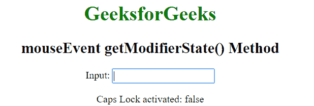
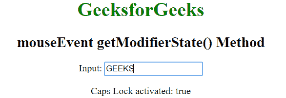

# Javascript | MouseEvent getModifierState()方法

> 原文:[https://www . geesforgeks . org/JavaScript-mouse event-getmodifier state-method/](https://www.geeksforgeeks.org/javascript-mouseevent-getmodifierstate-method/)

**MouseEvent GetModifierState()**用于返回事件发生时按下的指定修饰键的状态。如果按下了指定的修饰键，则返回 true 如果没有按下，则返回 false。

*   以下修饰键只有在按下时才会被激活:Alt、Control、Meta、Shift。
*   还有一些修饰键，点击时激活，再次点击时去激活:CapsLock、ScrollLock、NumLock。

**语法:**

```
event.getModifierState(key)
```

**参数**:

*   **键:**指修饰键。它区分大小写。

**返回值:**返回一个布尔值，表示指定的修饰键是否被激活。

*   **true:** 表示指定的修饰键被按下或激活。
*   **false:** 表示未按下指定的修饰键。

**示例:**在本例中，如果 CapsLock 被激活，则显示 true，否则显示 false。要查看效果，请在打开/关闭 CapsLock 后单击输入元素。

```
<!DOCTYPE html>
<html>
    <head>
        <title>JavaScript Mouse Event</title>
    </head>
    <body style = "text-align:center;">

        <h1 style = "color:green;">
            GeeksforGeeks
        </h1>

        <h2>
            mouseEvent getModifierState() Method
        </h2>

        Input: <input type="text" onmousedown="geek(event)">

        <p id="p"></p>

        <script>
        function geek(event) {
          var doc = event.getModifierState("CapsLock");
          document.getElementById("p").innerHTML = "Caps Lock activated: " + doc;
        }
        </script>
    </body>
</html>
```

**输出:**
**顶锁关闭(初始):**

**顶锁开启:**


**支持的浏览器:**getModifierState()方法支持的浏览器如下:

*   苹果 Safari 10.1
*   谷歌 Chrome 30.0
*   Firefox 15.0
*   Opera 17.0
*   Internet Explorer 9.0