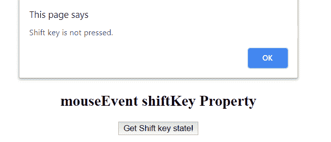

# JavaScript | MouseEvent shift key 属性

> 原文:[https://www . geesforgeks . org/JavaScript-mouse event-shift key-property/](https://www.geeksforgeeks.org/javascript-mouseevent-shiftkey-property/)

**mouseEvent shiftKey** 属性用于定义 shift 键是否被按下。它是一个布尔值。当按下 shift 键，然后点击鼠标左键，它返回真，如果没有按下 shift 键，它返回假。

**语法:**

```
event.shiftKey
```

**返回值:**返回一个布尔值，表示 shift 键是否被按下。

*   **真:**表示换档键被按下。
*   **假:**表示没有按下换挡键。

**示例:**

```
<!DOCTYPE html>
<html>
    <head>
        <title>JavaScript Mouse Event</title>
    </head>
    <body style = "text-align:center;">

        <h1 style = "color:green;">
            GeeksforGeeks
        </h1>

        <h2>
            mouseEvent shiftKey Property
        </h2>

        <button onclick="geek (event);">Get Shift key state!</button>        
        <script>
        function geek (event) {
            if (event.shiftKey) {
                alert ("Shift key is pressed.");
            }
            else {
                alert ("Shift key is not pressed.");
            }
        }
        </script>
    </body>
</html>
```

**输出:**
**点击按钮(Shift 键未按下):**

**点击按钮(Shift 键已按下):**


**支持的浏览器:**shift key 属性支持的浏览器如下:

*   苹果 Safari
*   谷歌 Chrome
*   火狐浏览器
*   歌剧
*   微软公司出品的 web 浏览器