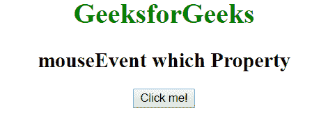
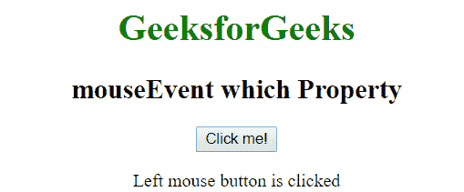
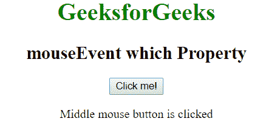
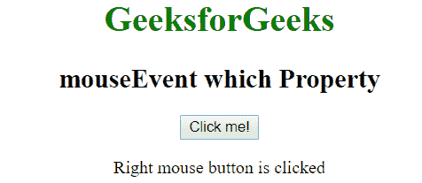

# Javascript | MouseEvent 哪个属性

> 原文:[https://www . geesforgeks . org/JavaScript-mouse event-what-property/](https://www.geeksforgeeks.org/javascript-mouseevent-which-property/)

鼠标事件**属性用于在鼠标事件被触发时返回与按下的鼠标按钮相对应的数字**

****语法:****

```
event.which
```

****返回值:**返回一个数字，表示按下了哪个鼠标键:**

*   **对于**鼠标左键:返回 1****
*   **对于**中间的**鼠标键:返回 2**
*   **对于**右**鼠标键:返回 3**

****示例:****

```
<!DOCTYPE html>
<html>

<head>
    <title>mouseEvent which Property</title>
</head>

<body style="text-align:center;">

    <h1 style="color:green;">
            GeeksforGeeks
        </h1>

    <h2>
            mouseEvent which Property
        </h2>

    <button onmousedown="geek(event)">Click me!</button>

    <p id="p"></p>
    <script>
        function geek(event) {
            if (event.which == 1) {
                document.getElementById('p').innerHTML = "Left mouse" 
                                              + " button is clicked ";
            } else if (event.which == 2) {
                document.getElementById('p').innerHTML = "Middle mouse" 
                                               + " button is clicked ";
            } else if (event.which == 3) {
                document.getElementById('p').innerHTML = "Right mouse" 
                                                + "button is clicked ";
            }
        }
    </script>
</body>

</html>                                
```

****输出:**
**点击按钮前:**

**点击鼠标左键后:**

**点击鼠标中键后:**

**点击鼠标右键后:**
**

****支持的浏览器:**鼠标事件支持的浏览器如下:**

*   **苹果 Safari 1.0**
*   **谷歌 Chrome 1.0**
*   **Firefox 1.0**
*   **Opera 5.0**
*   **Internet Explorer 9.0**