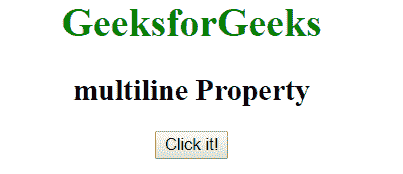
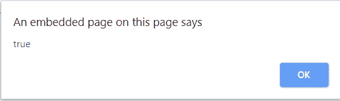
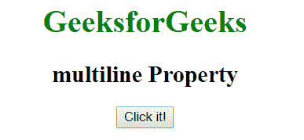
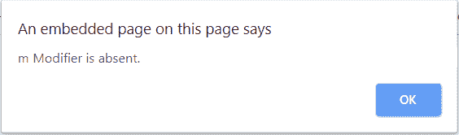

# JavaScript |多行属性

> 原文:[https://www . geesforgeks . org/JavaScript-multiline-property/](https://www.geeksforgeeks.org/javascript-multiline-property/)

Javascript 中的**多行属性**属性用于指定是否设置了**“m”***修改器*。如果设置了**“m”**修改器，则该属性返回 true，否则返回 false。

**语法:**

```
RegexObj.multiline
```

**返回值:**如果设置了 *m* 修改器，则返回真，否则返回假。

**示例-1:** 本示例检查正则表达式是否包含 **m** 修饰符。

```
<!DOCTYPE html>
<html>

<head>
    <title>
      multiline Property
  </title>
</head>

<body style="text-align:center">
    <h1 style="color:green">
      GeeksforGeeks
  </h1>
    <h2>multiline Property</h2>
    <button onclick="geek()">
      Click it!
  </button>

    <script>
        function geek() {
            var regex = new RegExp('foo', 'm');
            alert(regex.multiline);
        }
    </script>
</body>

</html>
```

**输出:**
**点击前:**

**点击后:**


**示例-2:** 本示例检查正则表达式是否包含 **m** 修饰符。

```
<!DOCTYPE html>
<html>

<head>
    <title>
      multiline Property
  </title>
</head>

<body style="text-align:center">
    <h1 style="color:green">
      GeeksforGeeks
  </h1>
    <h2>
      multiline Property
  </h2>
    <button onclick="geek()">
      Click it!
  </button>

    <script>
        function geek() {
            var regex = /[a-d]/;
            var str =
                "GeeksforGeeks\n"+
                "is the computer\n"+
                "science portal for geeks.";

            if (regex.multiline) {
                alert("m Modifier is present");
            } else {
                alert("m Modifier is absent.");
            }
        }
    </script>
</body>

</html>
```

**输出:**
**点击前:**


**点击后:**


**支持的浏览器:****多行属性**支持的浏览器如下:

*   谷歌 Chrome
*   苹果 Safari
*   Mozilla Firefox
*   歌剧
*   微软公司出品的 web 浏览器