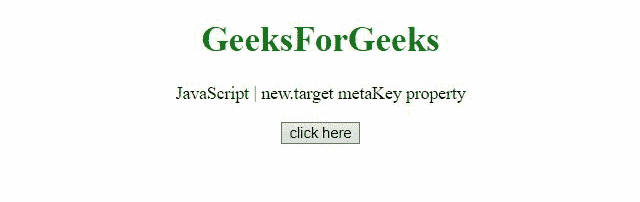

# JavaScript new.target 元属性

> 原文:[https://www . geesforgeks . org/JavaScript-new-target-meta-property/](https://www.geeksforgeeks.org/javascript-new-target-meta-property/)

**new.target** 伪属性让我们检测一个函数或构造函数是否在新运算符的帮助下被调用。

**语法:**

```
new.target
```

下面的示例演示了元属性。

**示例 1:** 在本例中，调用函数时没有使用新的运算符。

## 超文本标记语言

```
<!DOCTYPE HTML>
<html>

<body style="text-align:center;">
    <h1 style="color:green;">
        GeeksForGeeks
    </h1>

    <p>
        JavaScript | new.target metaKey property
    </p>

    <button onclick="Geeks();">
        click here
    </button>

    <p id="GFG_DOWN"></p>

    <script>
        var el_down = document
                .getElementById("GFG_DOWN");

        function Fun() {
            if (!new.target) {
                throw 
    'Fun() is called without new operator';
            }
        }
        function Geeks(event) {
            try {
                Fun();
            } catch (e) {
                el_down.innerHTML = e;
            }
        } 
    </script>
</body>

</html>
```

**输出:**


**示例 2:** 在本例中，使用新运算符调用函数。

## 超文本标记语言

```
<!DOCTYPE HTML>
<html>

<body style="text-align:center;">
    <h1 style="color:green;">
        GeeksForGeeks
    </h1>
    <p>
        JavaScript | new.target metaKey property
    </p>

    <button onclick="Geeks();">
        click here
    </button>

    <p id="GFG_DOWN"></p>

    <script>
        var el_down = document
                .getElementById("GFG_DOWN");
        class Person {
            constructor(name) {
                this.name = name;
                if (!new.target) {
throw 'Function is called without new operator';
                }
                else {
throw 'Function is called with new operator';
                }
            }
        }
        function Geeks(event) {
            try {
                var p = new Person('GFG');
            } catch (e) {
                el_down.innerHTML = e;
            }
        } 
    </script>
</body>

</html>
```

**输出:**
