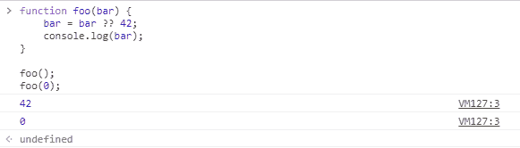
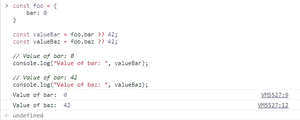

# JavaScript 无效合并操作符

> 原文:[https://www . geesforgeks . org/JavaScript-null ish-聚结-operator/](https://www.geeksforgeeks.org/javascript-nullish-coalescing-operator/)

下面是无效合并运算符的示例。

*   **例:**

    ```
    <script>
    function foo(bar) {
        bar = bar ?? 55;
        document.write(bar);
        document.write("</br>");

    }
    foo();  // 55
    foo(22); // 22
    </script>
    ```

*   **输出:**

    ```
    55
    22
    ```

**无效合并操作符:**这是 ECMA 提案中引入的一个新特性，现已被正式的 JavaScript 规范采用。如果左侧值为**空**或**未定义**，则该运算符返回右侧值。如果不为空或未定义，那么它将返回左边的值。之前，设置**未定义**和**空**变量的默认值需要使用 **if** 语句或逻辑 or 运算符“||”，如下所示:

*   **程序:**

    ```
    <script>
    function foo(bar) {
        bar = bar || 42;
        console.log(bar);
    }

    // Output: 42
    foo();
    </script>
    ```

*   **输出:**

    ```
    42
    ```

当传递的参数小于函数原型中定义的参数个数时，赋予其**未定义**的值。要为函数调用期间未传递的参数设置默认值，或者为 JSON 对象中不存在的字段设置默认值，上述方法很受欢迎。

*   **程序:**

    ```
    </script>
    function foo(bar) {
        bar = bar || 42;
        console.log(bar);
    }
    // Output: 42
    foo(0);
    </script>
    ```

*   **输出:**

    ```
    42
    ```

JavaScript 中有一些值，比如 0 和空字符串，本质上是逻辑假的。这些值可能会改变用 JavaScript 编写的程序的预期行为。

所有重复出现的问题导致了**无效合并操作符**的开发。无效合并运算符由两个相邻的问号**定义？？**及其用途如下:

*   **语法:**

    ```
    variable ?? default_value
    ```

**示例:**如果传递的变量为空或未定义，并且只有当它是这两个值时，才会返回默认值。在所有其他情况下，包括 0、空字符串或 false，将返回变量值，而不是默认值。

*   **节目 1:**

    ```
    <script>
    function foo(bar) {
        bar = bar ?? 42;
        console.log(bar);
    }

    foo();  // 42
    foo(0); // 0
    </script>
    ```

*   **输出:** 
*   **程序 2:** 更常见的用例是如下设置 JSON 对象的默认值。

    ```
    <script>
    const foo = {
        bar: 0
    }

    const valueBar = foo.bar ?? 42;
    const valueBaz = foo.baz ?? 42;

    // Value of bar: 0
    console.log("Value of bar: ", valueBar);

    // Value of bar: 42
    console.log("Value of baz: ", valueBaz);
    </script>
    ```

*   **输出:**
    

**支持的浏览器:****JavaScript null ish 合并**操作符支持的浏览器如下:

*   谷歌 Chrome 80
*   Firefox 72