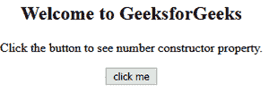
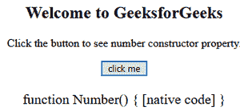

# JavaScript 数字构造器属性

> 原文:[https://www . geesforgeks . org/JavaScript-number-constructor-property/](https://www.geeksforgeeks.org/javascript-number-constructor-property/)

下面是数字构造函数属性的示例。

*   **例:**

## 超文本标记语言

```
<!DOCTYPE html>
<html> 

<body style="text-align:center;">
    <h2>
        Welcome to GeeksforGeeks
    </h2>

<p>
        Click the button to see number
        constructor property.
    </p>

    <button onclick="myGeeks()">
        click me
    </button>

    <p id="GFG" style="font-size:20px;" ></p>

    <!--Script to use Number constructor property-->
    <script>
        function myGeeks() {
            var num = 420;

            document.getElementById("GFG").innerHTML
                    = num.constructor;
        }
    </script>
</body>

</html>                    

```

*   **输出:**
    *   **点击按钮前:**



*   **点击按钮后:**



Javascript 中的**数字构造函数属性**用于返回对象的数字构造函数。此属性返回的函数只是对此函数的引用，而不是包含函数名称的数字。JavaScript 数字构造函数、字符串构造函数和布尔构造函数分别返回 Number(){[本机代码] }、String(){[本机代码] }和 Boolean(){[本机代码] }函数。
**语法:**

```
number.constructor
```

**返回值:**此函数返回 Number(){[本机代码]。
以上属性的更多示例代码如下:
**程序 1:**

## 超文本标记语言

```
<script>
    var num = 444;
    document.write(num.constructor);
</script>
```

**输出:**

```
function Number() { [native code] }
```

**节目 1:**

## 超文本标记语言

```
<script>
    var num = 44.44;
    document.write(num.constructor);
</script>
```

**输出:**

```
function Number() { [native code] }
```

**支持的浏览器:**

*   谷歌 Chrome 6.0 及以上版本
*   Internet Explorer 9.0 及以上版本
*   Mozilla 4.0 及以上版本
*   Opera 11.1 及以上
*   Safari 5.0 及以上版本