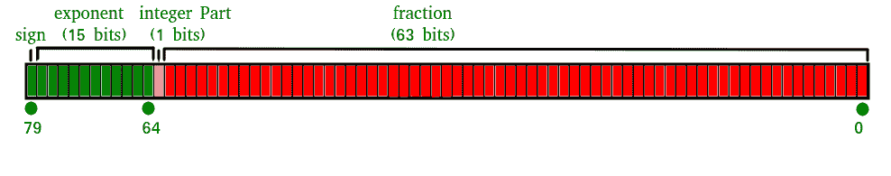

# JavaScript Number isSafeInteger()方法

> 哎哎哎:# t0]https://www . geeksforgeeks . org/JavaScript-number-Issa finteger/

下面是 Number isSafeInteger()方法的示例。

*   **示例:**

## java 描述语言

```
<script type = "text/javascript">
document.write("Output : " + Number.isSafeInteger(44));
</script>
```

*   输出:

```
Output : true
```

**什么是安全整数？**
安全整数是具有以下属性的整数

*   可以表示为 IEEE-754 双精度数的数字，即从(2<sup>53</sup>–1)到-(2<sup>53</sup>–1)的所有整数。

**什么是 IEEE-754 双精度数？**
双精度浮点格式是一种计算机数字格式，占用计算机内存 64 位。
它通过使用浮点来表示大范围的数值。
IEEE 754 标准规定二进制 64 具有:
符号位:1 位
指数:11 位
有效位和精度:53 位(显式存储 52 位)



**JavaScript 中的 isSafeInteger()方法**

JavaScript 中的 **isSafeInteger()** 方法用来检查一个数字是否是安全整数。

**语法:**

```
Number.isSafeInteger(Value)
```

**所用参数:**
**1。值:**是安全整数()方法要检查的数字。

**返回值:**
如果值是安全整数 Number，则 JavaScript 中的 toExponential()方法返回 true，否则返回 false。

**示例:**

```
Input : Number.isSafeInteger(23)
Output : true

Input : Number.isSafeInteger(-23)
Output : true

Input : Number.isSafeInteger(0.5)
Output : false

Input : Number.isSafeInteger(0/0)
Output : false
```

**1。在 isSafeInteger()方法中传递一个正数作为参数。**

## java 描述语言

```
<script type = "text/javascript">
document.write("Output : " + Number.isSafeInteger(23));
</script>
```

输出:

```
Output : true
```

**2。在 isSafeInteger()方法中传递负数作为参数。**

## java 描述语言

```
<script type = "text/javascript">
document.write("Output : " + Number.isSafeInteger(-23));
</script>
```

输出:

```
Output : true
```

**3。在 isSafeInteger()方法中传递一个数字(带小数)作为参数。**

## java 描述语言

```
<script type = "text/javascript">
document.write("Output : " + Number.isSafeInteger(0.5));
</script>
```

输出:

```
Output : false
```

**4。在 isSafeInteger()方法中传递一个等式(等于一个无穷大的值)作为参数。**

## java 描述语言

```
<script type = "text/javascript">
document.write("Output : " + Number.isSafeInteger(0 / 0));
</script>
```

输出:

```
Output : false
```

**代码说明:** JavaScript 使用 IEEE 754 中规定的双精度浮点格式数字，只能安全地表示-(2<sup>53</sup>–1)和 2<sup>53</sup>–1 之间的数字。如果传递的参数在这个指定的范围内，那么 number.isSafeInteger()方法返回 true 否则返回 false。

**支持的浏览器:**

*   谷歌 Chrome
*   微软公司出品的 web 浏览器
*   火狐浏览器
*   苹果 Safari
*   歌剧