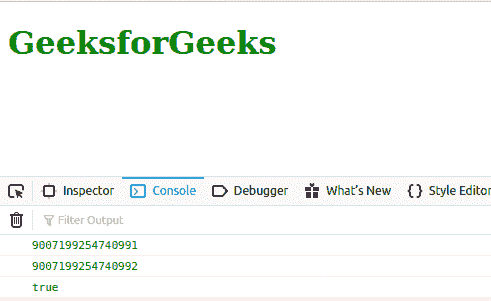
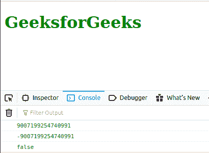

# JavaScript 编号。最大安全整数常数

> 原文:[https://www . geesforgeks . org/JavaScript-number-max _ safe _ integer-constant/](https://www.geeksforgeeks.org/javascript-number-max_safe_integer-constant/)

下面是数字的例子。最小安全整数常数。

*   **例:**

    ```
    <script type="text/javascript">
        document.write(Number.MIN_SAFE_INTEGER); 
    </script> 
    ```

*   **输出:**

    ```
    9007199254740991
    ```

JavaScript **号。MAX_SAFE_INTEGER** 是代表最小安全整数的常数。该常数的值为(2<sup>53</sup>–1)。这里 *safe* 指的是表示整数和比较整数的能力。

**示例:**

```
Number.MAX_SAFE_INTEGER + 1 === Number.MAX_SAFE_INTEGER + 2
```

上面的表达式将评估为*真*，这实际上在数学上是不正确的。

**语法:**

```
Number.MAX_SAFE_INTEGER

```

**返回值:**一个常数。

**例 1:** 下面的例子说明了**号的用法。MAX_SAFE_INTEGER**

```
<!DOCTYPE html>
<html lang="en">

<body>
    <h1 style="color: green;">GeeksforGeeks</h1>
    <script type="text/javascript">
        const a = Number.MAX_SAFE_INTEGER + 1;
        const b = Number.MAX_SAFE_INTEGER + 2;

        console.log(Number.MAX_SAFE_INTEGER);
        console.log(a);
        console.log(a === b);
    </script>
</body>

</html>
```

**输出:**



**例 2:** 下面的例子说明了常量**数的用法。使用**数学功率()**功能。**

```
<!DOCTYPE html>
<html lang="en">

<body>
    <h1 style="color: green;">GeeksforGeeks</h1>
    <script type="text/javascript">
        const a = Number.MAX_SAFE_INTEGER;
        const b = -(Math.pow(2, 53) - 1);

        console.log(a);
        console.log(b);
        console.log(a === b);
    </script>
</body>

</html>
```

**输出:**



**支持的浏览器:**

*   铬
*   互联网浏览器(不支持)
*   火狐浏览器
*   边缘
*   旅行队
*   歌剧