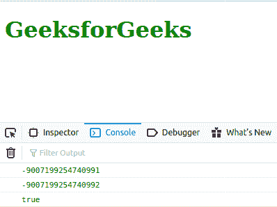
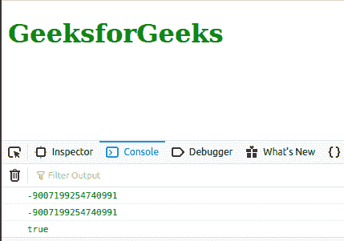

# JavaScript 编号。最小安全整数常数

> 原文:[https://www . geesforgeks . org/JavaScript-number-min _ safe _ integer-constant/](https://www.geeksforgeeks.org/javascript-number-min_safe_integer-constant/)

下面是数字的例子。最小安全整数常数。

*   **例:**

    ```
    <script type="text/javascript">
        document.write(Number.MIN_SAFE_INTEGER); 
    </script> 
    ```

*   **输出:**

    ```
    -9007199254740991
    ```

JavaScript **号。最小安全整数**是一个常数，代表最小安全整数。该常数的值为(-(2<sup>53</sup>–1))。

使用**号。MIN_SAFE_INTEGER** ，作为数字对象的属性，因为它是数字的静态属性。

**语法:**

```
Number.MIN_SAFE_INTEGER
```

**返回值:**常数。

**例 1:** 下面的例子说明了简单**数的用法。最小安全整数**常数。

```
<!DOCTYPE html>

<html lang="en">

<body>
    <h1 style="color: green;">GeeksforGeeks</h1>
    <script type="text/javascript">
        const a = Number.MIN_SAFE_INTEGER - 1;
        const b = Number.MIN_SAFE_INTEGER - 2;

        console.log(Number.MIN_SAFE_INTEGER);
        console.log(a);
        console.log(a === b);
    </script>
</body>

</html>
```

**输出:**



**例 2:** 下面的例子说明了**号的用法。使用**数学.功率()**函数的最小安全整数**常数。

```
<!DOCTYPE html>

<html lang="en">

<body>
    <h1 style="color: green;">GeeksforGeeks</h1>
    <script type="text/javascript">
        const c = Number.MIN_SAFE_INTEGER;
        const d = -(Math.pow(2, 53) - 1);

        console.log(c);
        console.log(d);
        console.log(c === d);
    </script>
</body>

</html>
```

**输出:**



**注意:**不支持 Internet explorer。

**支持的浏览器:**

1.  铬
2.  边缘
3.  火狐浏览器
4.  歌剧
5.  旅行队